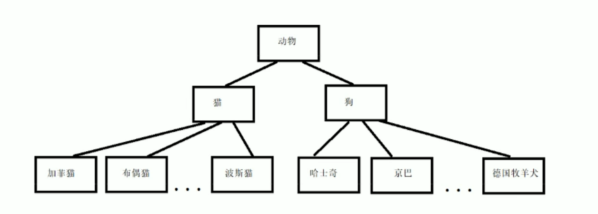
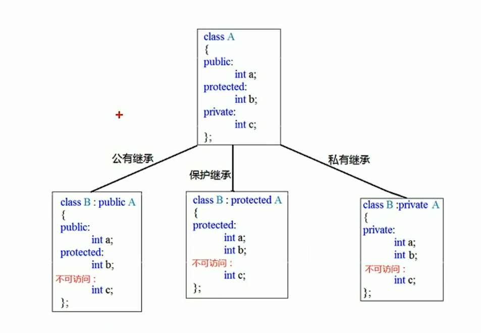
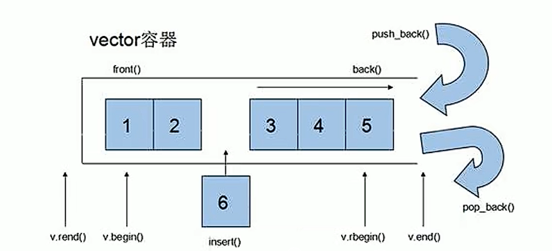

# C++学习笔记

## C++头文件命名约定

* C++新式风格：没有扩展名(例如iostream)
* 转换后的C：加上前缀c，没有扩展名(例如cmath)

## C++通用字符名

* ISO10646
  * 以\u或\U开头；\u后面是8个16进制位，\U后面是16个16进制位

## C++强制类型转换

* 通用格式
  * C风格:(typename) value
  * C++风格:typename (value)

* 强制类型转换运算符
  * `static_cast<typename> (value)`

## C++11数组初始化

* 初始化数组时可省略'='
  * `char arr[5] {1, 2, 3, 4, 5};`

* 可不在大括号内包含任何东西，这将把所有元素设为0:
  * `unsigned int arr[5] {};`

* 列表初始化不允许缩窄转换
  * `long num[] = {1, 2, 3.33};//not allowed`

## C++字符串输入

* cin.getline()

  * getline()函数读取整行，通过换行符确定输入结尾。

  * getline()有两个参数，第一个参数是用来存储输入行的数组的名称，第二个参数是要读取的字符数。如果这个参数为20，则函数最多读取19个字符，余下的空间用来存储自动在结尾处添加的空字符。

  * getline()成员函数在读取指定数目字符或遇到换行符时停止读取
    `//cin.getline(name, 20);`

  * getline()到达换行符时将停止输入并丢弃换行符

* cin.get()

  * 与getline类似，都接受相同的参数，解释参数的方式也相同，并且都读到行尾。

  * get不再读取并丢弃换行符，而是将其留在输入队列中

## new和delete

* 使用new来分配内存: `int* pn = new int;`

* 使用delete来释放内存: `delete pn;`

* 使用new创建动态数组: `int* arr = new int[10];`

* 使用new和delete时应遵守以下规则

  * 不要使用delete来释放不是new分配的内存

  * 不要使用delete释放同一个内存块两次

  * 如果使用new []为数组分配内存，则应使用delete []来释放

  * 对空指针使用delete是安全的
  
### 尽可能地使用const

将指针参数声明为指向常量数据的指针有两条理由:

* 这样可以避免由于无意间修改数据而导致的编程错误
* 使用const使得函数能够处理const和非const实参,否则将只能接受非const数据.如果条件允许,则应将指针实参声明为指向const的指针.

## 自动存储，静态存储，动态存储

1. 自动存储

    * 在函数内部定义的常规变量使用自动存哦戳空间，被成为自动变量(automatic variable)，这意味着它们在所属的函数被调用时自动产生，在该函数结束时消亡

2. 静态存储

    * 静态存储是整个程序执行期间都存在的存储方式

    * 使变量成为静态的方式有两种:一种是在函数外面定义它，一种是在声明变量时使用关键字static

3. 动态存储

    * new和delete运算符操作的存储空间

## 函数

---

### 函数默认参数

在C++中,函数的形参列表中的形参是可以有默认值的.
语法:`返回值类型 函数名 (参数 = 默认值) {}`

**示例:**

``` cpp
int func(int a, int b = 10, int c = 10) {
  return a + b + c;
}

//1.如果某个位置参数有默认值,那么从这个位置往后,从左向右,必须都要有默认值
//2.如果函数声明有默认值,函数实现的时候就不能有默认参数
int func2(int a = 10, int b = 10);
int func2(int a, int b) {
  return a + b;
}

int main(void) {
  cout << func(10) << endl;

  return 0;
}
```

### 函数占位参数

C++中函数的形参列表里可以有占位参数,用来占位,调用函数时必须填补该位置

**语法:** `返回值类型 函数名 (数据类型) {}`

**示例:**

``` cpp
//函数占位参数,占位参数也可以有默认参数
void func(int a, int) {
  cout << "this is func" << endl;
}

int main(void) {
  func(10, 10)  //占位参数必须填补

  return 0;
}
```

### 函数重载

**作用:** 函数名可以相同,提高复用性

**函数重载满足条件:**

* 同一个作用域下
* 函数名称相同
* 函数参数**类型不同**或者**个数不同**或者**顺序不同**

**注意:** 函数的返回值不可以作为函数重载的条件

**示例:**

``` cpp
//函数重载需要函数都在同一个作用域下
void func() {
  cout << "func的调用!" << endl;
}

void func(int a) {
  cout << "func的调用!" << endl;
}

void func(int a, double b) {
  cout << "func的调用!" << endl;
}
```

#### 函数重载注意事项

* 引用作为重载条件
* 函数重载碰到函数默认参数

**示例:**

``` cpp
//函数重载注意事项
//1.引用作为重载条件

void func(int &a) {
  cout << "func (int &a) 调用" << endl;
}

void func(const int &a) {
  cout << "func (const int &a) 调用" << endl;
}

//2.函数重载碰到默认参数
void func2(int a) {
  cout << "func2 (int a) 调用" << endl;
}

void func2(int a, int b = 10) {
  cout << "func2 (int a, int b) 调用" << endl;
}

int main(void) {
  int a = 10;
  
  func(a);  //会使用第一个func
  func(10)  //会使用第二个func

  func2(10);  //不可以,当函数重载碰到默认参数,会出现二义性,尽量避免这种情况
  func2(10, 20);  //可以,将使用第二个func2

  return 0;
}
```

### C++内联函数

#### 为什么使用内联函数

* 内联函数最初的定义:代替部分#define宏定义
* 使用使用内联函数代替普通函数的目的:提高程序的运行效率

##### 1.为什么要代替部分宏定义

* 宏是预处理指令,在预处理的时候把所有的宏名用宏体来替换,内联函数是函数,在编译阶段把所有调用内联函数的地方把内联函数插入.
* 宏没有类型检查,无论对错都直接替换,而内联函数在编译时进行安全检查.
* 对于C++而言,使用宏代码还有另一种缺点:无法操作类的私有数据成员.

##### 2.普通函数频繁调用消耗栈空间

函数是一个可以频繁使用的代码块,CPU会一条一条地执行其中的代码.CPU在执行主调函数代码时如果遇到了被调函数,主调函数就会暂停,CPU转而执行被调函数的代码,被调函数执行完毕后再回到主调函数,主调函数根据刚才的状态继续执行.

一个C/C++程序的执行过程可以认为是多个函数之间相互调用的过程,他们形成了一个简单或复杂的调用链条,这个链条的起点是main(),终点也是main().当main()调用完了所有的函数,他会返回一个值(例如return 0)来结束自己的生命,从而结束整个程序.

栈空间就是指放置模式的局部数据也就是函数内数据的内存空间,在系统下,栈空间是有限的,频繁大量地使用就会造成因栈空间不足而导致的问题,函数的死循环递归调用的结果就是栈内存空间枯竭.

如果函数体的代码比较多,需要较长的执行时间,那么函数调用机制占用的时间可以忽略,如果函数语句只有一两条,那么大部分时间都会花费在函数调用机制上,这种时间开销就不容忽视.

#### 使用内联函数

要使用这项特性,必须采取下述措施之一:

* 在函数声明前加上关键字inline.
* 在函数定义前加上关键字inline.

```   cpp
inline int sum(int a, int b) {
  return (a + b);
}
```

通常的做法是省略原型,将整个定义(即函数头和所有函数代码)放在本应该提供原型的地方.
程序员请求将函数作为内联函数时,编译器并不一定会满足这种要求.他可能认为该函数过大或注意到函数调用了自己(内联函数不能递归),因此不将其作为内联函数,而有些编译器没有启用或实现这种特性.

#### 内联的局限性

1. 内联是以代码膨胀为代价,仅仅省去了函数调用的开销,从而提高函数的运行效率.如果执行函数体内代码的时间,相比于函数调用的开销大,那么效率的收获会很少.(一般情况下,在函数频繁调用且函数内部代码很少的情况下使用内联)
2. 每一处内联函数的调用都要复制代码,这将程序的总代码量增大,消耗更多内存空间.
3. 类的构造函数和析构函数容易让人误解成使用内联更有效.要当心构造函数和析构函数可能会隐藏一些行为,如"偷偷地"执行了基类或成员对象的构造函数和析构函数.所以不要随便地将构造函数和析构函数的定义放在类声明中.
4. 一个好的编译器会根据函数的定义,自动取消不值得的内联(这进一步说明了inline不应该出现在函数的声明).对函数inline声明只是程序员对编译器提出的一个建议,而不是强制性的,并非一经指定为inline编译器就必须这样做.编译器有自己的判断能力,它会根据具体情况决定是否这样做.具体是否会被编译器优化为内联也要看优化级别.有些函数即使声明为内联也不一定会被编译器内联,比如虚函数和递归函数就不会被正常内联.通常,递归函数不应该声明为内联函数.(递归调用堆栈并不像循环那么简单,比如递归层数在编译时可能是未知的,大部分编译器都不支持内联递归函数).将内联函数放在头文件里实现是合适的,省却你为每一个文件实现一次的麻烦.如果每个文件都实现一次该内联函数的话,最好保证每个定义都是一样的,否则将会引起未定义行为.

## 引用

**作用:** 给变量起别名

**语法:**`数据类型 &别名 = 原名`

``` cpp
int a = 233;
int &b = a;
```

### 引用的注意事项

* 引用必须初始化
* 引用在初始化后,不可以改变
* 一个变量可以有多个引用
* 一个引用可以继续有引用
* 可以对任何类型做引用
* 引用不是定义一个新的变量,而是给已经存在的变量取一个别名,编译器不会为引用变量开辟内存空间,它和它引用的变量共用同一块内存空间.

### 引用做函数参数

**作用:** 函数传参时,可以利用引用的技术让形参修饰实参.
**优点:** 可以简化指针修改实参.

``` cpp
//1.值传递
void mySwap1(int a, int b) {
  int temp = a;
  a = b;
  b = temp;
}

//2.地址传递
void mySwap2(int* a, int* b) {
  int temp = *a;
  *a = *b;
  *b = temp;
}

//3.引用传递
void mySwap3(int &a, int &b) {
  int temp = a;
  a = b;
  b = temp;
}
```

### 引用做函数返回值

作用:引用是可以作为函数的返回值存在的

注意:不要返回局部变量引用
用法:函数调用作为左值

**示例:**

``` cpp
//返回局部变量引用
int& test01() {
  int a = 10; //局部变量
  return a;
}

//返回静态变量引用
int& test02() {
  static int a = 20;
  return a;
}
```

### 引用的本质

本质: **引用的本质在C++内部实现是一个指针常量.**

``` cpp
//发现是引用,转换为 int* const ref = &a;
void func(int& ref) {
  ref = 100; //ref是引用,转换为*ref = 100
}

int main(void) {
  int a = 10;

  //自动转换为 int* const ref = &a; 指针常量是指针指向不可改变,也说明为什么引用不可改变
  int& ref = a; //内部发现ref是引用,自动帮我们转换为: *ref = 20;

  cout << "a:" << a << endl;
  cout << "ref:" << ref << endl;

  func(a);
  return 0;
}
```

### 常量引用

**作用:** 常量引用主要用来修饰形参,防止误操作

在函数形参列表中,可以加**const修饰形参**,防止形参改变实参

**示例:**

``` cpp
void showValue(const int& v) {
  //v += 10;
  cout << v << endl;
}

int main(void) {
  //int& ref = 10; 应用本身需要一个合法的内存空间,因此这行错误
  //加入const就可以了,编译器优化代码, int temp = 10; const int& ref = temp;
}
```

## 类和对象

---

C++面向对象的三大特向为: **封装,继承,多态**

C++认为万物皆对象,对象上具有其属性和行为

### 封装

#### 封装的意义

封装是C++面向对象三大特性之一

封装的意义:

* 将属性和行为作为一个整体,表现生活中的事物
* 将属性和行为加以权限控制

在设计类的时候,属性和行为写在一起,表现事物

**语法:** `class 类名{访问权限 : 属性 / 行为};`

类在设计时,可以把属性和行为放在不同的权限下,加以控制

访问权限有三种:

1. public 公共权限,成员在类内外都可以访问;任何一种继承,子类都可以访问父类的公共成员.
2. protected 保护权限,成员在类内可访问;类外不可访问,任何一种继承,子类都可以访问父类的保护成员.
3. private 私有权限,类内可以访问,类外不可访问;任何一种继承,子类都**不可以**访问父类的私有成员.

#### struct和class的区别

在C++中struct和class唯一的区别是默认访问权限不同

* struct默认权限为公有
* calss默认权限为私有

#### 将属性成员设置为私有

**优点1:** 将所有成员属性设置为私有,可以自己控制读写权限.
**优点2:** 对于写权限,我们可以检测数据的有效性.

示例:

``` cpp
using namespace std;

class Person {
  public:

    void setName(string name) {
      m_Name = name;
    }
    string getName() {
      return m_Name;
    }

  private:

    string m_Name;    
}
```

### 对象的初始化和清理

* 生活中我们买的电子产品都基本会有出厂设置,在某一天我们不用时也会删除一些自己的信息数据保证安全.
* C++中的面向对象来源于生活,每个对象也都会有初始设置以及对象销毁前的清理数据设置.

#### 构造函数与析构函数

对象的**初始化和清理**也是两个重要的安全问题

* 一个对象或者变量没有初始状态,对其使用的后果是未知.
* 同样使用完一个变量或对象,没有及时清理,也会造成一定的安全问题.

C++利用了**构造函数和析构函数**解决上述问题,这两个函数会被编译器自动调用,完成对象初始化和清理工作.
对象的初始化和清理工作是编译器强制要我们做的事情,因此如果**我们不提供构造和析构,编译器会提供**.
**编译器提供的构造函数和析构函数是空实现**.

* 构造函数:主要作用在于创建对象时为对象的成员属性赋值,构造函数由编译器自动调用,无需手动调用.
* 析构函数:主要作用在于对象**销毁前**系统自动调用,执行一些清理工作.

**构造函数语法:**`类名(){}`

1. 构造函数,没有返回值也不写void.
2. 函数名称与类名相同.
3. 构造函数可以有参数,因此可以发生重载.
4. 程序在调用对象时会自动调用构造,无需手动调用,而且只会调用一次.

**析构函数语法:**`~类名(){}`

1. 析构函数,没有返回值也不写void.
2. 函数名称与类名相同,在名称前加符号'~'.
3. 析构函数不允许有参数,因此不可以发生重载.
4. 程序在对象销毁前会自动调用析构,无需手动调用,而且只会调用一次.

#### 构造函数的分类及调用

两种分类方式:

1. 按参数分为:有参构造和无参构造.
2. 按类型分为:普通构造和拷贝构造.

三种调用方式:

1. 括号法
2. 显示法
3. 隐式转换法

C++中的构造函数可以分为5类:默认构造函数,普通构造函数,拷贝构造函数,转换构造函数,移动构造函数

##### 默认构造函数

不带参数的构造函数，通常用于初始化对象的默认状态.默认构造函数的原型为:

``` cpp
Student();//没有参数
Student(int num = 0, int age = 0);//所有参数均有默认值
```

###### 何时生成默认构造函数

当一个类**没有默认构造函数时**,如果满足以下四个条件之一,则编译器会为该类自动生成一个默认的构造函数:

1. 该类含有一个类类型(非内置类型)的成员变量,且该类型含有默认构造函数.
2. 该类型继承自含有默认构造函数的基类.
3. 该类继承或声明了虚函数.
4. 该类含有虚基类.

##### 普通构造函数

C++用于构建类的新对象时需要调用的函数

``` cpp
Student(int num, int age);//有参数
```

##### 拷贝构造函数

###### 何时生成拷贝构造函数

当一个类**没有拷贝构造函数时**,如果满足以下四个条件其中之一,则编译器会为该类自动生成一个默认的拷贝构造函数:

1. 该类含有一个类类型(非内置类型)的成员变量,且该类型含有拷贝构造函数.
2. 该类继承自含有拷贝构造函数的基类.
3. 该类继承或声明了虚函数.
4. 该类含有虚基类.

需要注意的是,默认的拷贝构造函数实现的是**浅拷贝**.

###### 拷贝构造函数调用的时机

拷贝构造函数在以下三种情况会被调用.

1. 当用一个对象去初始化另一个对象的时候,会引发拷贝构造函数被调用.例如,下面的两条语句都会引发拷贝构造函数的调用,用以初始化c2.

``` cpp
Complex c2(c1);
Complex c2 = c1;
```

这两条语句是等价的.

注意,**第二条语句是初始化语句,不是赋值语句**.赋值语句的等号左边是一个早已定义的变量,**赋值语句不会引发拷贝构造函数的调用**.例如:

``` cpp
Complex c1, c2;
c1=c2;
```

**这条语句不会引发拷贝构造函数的调用**,因为c1早已声明,已经初始化了.

2. 如果函数F的参数是类A的对象,那么当F被调用时,类A的拷贝构造函数将被调用.
也就是说,**作为形参的类A的对象,使用拷贝构造函数初始化的**,而且调用拷贝构造函数时的参数,就是调用函数时所给的实参.

``` cpp
#include <iostream>
using namespace std;
class A {
  public:
    A() {}
    A(A & a) {
      cout << "调用拷贝构造函数" << endl;
    }
};
void func(A a) {}
int main(void) {
  A a;
  func(a);
  return 0;
}
```

func函数的形参a在初始化时调用了拷贝构造函数.

以对象作为函数的形参,在函数被调用时,生成的形参要用于拷贝构造函数的初始化,这会带来时间上的开销.
如果用对象的引用而不是对象作为形参,就没有这个问题了.

3. 如果函数的返回值是类A的对象,则函数返回时,类A的拷贝构造参数将被调用.

``` cpp
#include <iostream>
using namespace std;
class A {
  public:
    int v;
    A(int n) {v = n;}
    A(const A & a) {
      v = a.v;
      cout << "调用拷贝构造函数" << endl;
    }
};
A func() {
  A a(4);
  return a;
}
int main(void) {
  cout << func().v << endl;
  return 0;
}
```

##### 转换构造函数

一个构造函数接收一个不同于其类型的形参,可以视为将其形参转换成类的一个对象.像这样的构造函数称为转换构造函数.
在C++**string类中可以找到使用转换构造函数的使用示例**.string类提供一个将C字符串转换为string的转换构造函数.

``` cpp
class string {
  //仅显示转换构造函数
  public:
    string(char *);//形参是其他类型变量,且只有一个形参.
};
```

##### 移动构造函数

移动构造函数用于从即将销毁的临时对象转移资源到新对象。它通常用于避免不必要的资源复制，并提高性能.

``` cpp
class Person {
  public:
    string name;
    int age;

    Person(Person&& other) {  //移动构造函数
      name = std::move(other.name);
      age = other.age;
      //将other的资源转移到this
    }
};

int main(void) {
  Person p1("bob", 25); //创建p1对象
  Person p2(std::move(p1)); //移动构造函数创建p2

  cout << p2.name << ", " << p2.age << endl; // 输出：Bob, 25
  cout << p1.name << ", " << p1.age << endl; // 输出：, 0 (p1 的资源已转移)

  return 0;
}
```

#### 深拷贝和浅拷贝

浅拷贝只复制指向某个对象的指针,而不复制对象本身,新旧对象还是共享同一块内存(分支).

1. 浅拷贝只是按位拷贝对象,他会创建一个对象,这个对象拥有着原始对象属性值的一份精确拷贝.
2. 如果属性是基本类型,拷贝的就是基本类型的值;如果属性是内存地址(引用类型),拷贝的就是内存地址,因此如果其中一个对象改变了这个地址,就会影响到另一个对象.

深拷贝会另外创建一个一模一样的对象,新对象跟原对象不共享内存,修改新对象不会修改旧对象(不是分支).

1. 拷贝第一层级的对象属性或数组元素
2. 递归拷贝所有层级的对象属性和数组元素
3. 深拷贝会拷贝所有的属性,并拷贝属性指向的动态分配的内存.当对象和它所引用的对象一起拷贝即发生深拷贝.深拷贝相比于浅拷贝速度较慢并且花销较大.

#### C++初始化列表

C++提供了初始化列表语法,用来初始化属性

**语法:**``构造函数():属性1(值1),属性2(值2)...{}``

**示例:**

``` cpp
class Person {
  public:
  //传统方式初始化
  person(int a, int b, int c) {
    mA = a;
    mB = b;
    mC = c;
  }

  //初始化列表方式初始化
  Person(int a, int b, int c): mA(a), mB(b), mC(c) {}

  private:
  int mA;
  int mB;
  int mC;
}
```

### 对象作为类成员

C++类中的成员可以是另一个类的对象,我们称该成员为对象成员

例如:

``` cpp
class A {}
class B
{
  A a;
}
```

当其他类对象作为本类成员,构造时先构造类对象,再构造自身,析构的顺序与构造相反.

### 静态成员

静态成员就是在成员变量和成员函数前加上关键字static,称为静态成员

静态成员分为:

* 静态成员变量
  * 所有对象共享同一份数据
  * 在编译阶段分配内存
  * 类內声明,类外初始化
* 静态成员函数
  * 所有对象共享同一个函数
  * 静态成员函数只能访问静态成员变量

静态成员变量不属于某个对象,所有对象都共享同一份数据,因此静态成员变量有两种访问方式

1. 通过对象进行访问

``` cpp
Person P;
std::cout << p.m_A << std::endl;
```

2. 通过类名进行访问

``` cpp
std::cout << Person::m_A << std::endl;
```

类外访问不到私有静态成员变量

静态成员函数有两种访问方式

1. 通过对象访问

``` cpp
Person p;
p.func();
```

2. 通过类名访问

``` cpp
Person::func();
//类外访问不到私有静态成员函数
```

静态成员函数可以访问静态成员变量
静态成员函数不可以访问非静态成员变量,无法区分到底是哪个对象的变量
静态成员函数也有访问权限

### C++对象模型和this指针

* 在C++中,类内的成员变量和成员函数分开存储
* 只有非静态成员变量才属于类的对象
* 空对象占用内存空间为1字节
* C++编译器会给每个空对象分配一个字节空间,是为了区分空对象占用内存的位置,每个空对象也应该有一个独一无二的地址
* 注意：类的静态数据成员是静态存储，它是静态生存周期，**必须进行初始化**
* 注意：静态数据成员的初始化在类体外进行,前面不加static以免与一般静态变量或者对象混淆

#### this指针概念

每一个非静态成员函数只会诞生一份函数实例,也就是说多个同类型的对象会共用同一份代码
那么问题是:这一块代码是如何区分哪个对象调用了自己呢?

C++通过提供特殊的对象指针,this指针,解决上述问题.**this指针指向被调用的成员函数所属的对象**.

this指针是隐含在每一个非静态成员函数内的一种指针
this指针不需要定义,直接使用即可

this指针的用途:

* 当形参和成员变量同名时,可用this指针来区分
* 在类的非静态成员函数中返回对象本身,可使用return *this

#### 空指针访问成员函数

C++中空指针也是可以调用成员函数的,但是要注意有没有用到this指针
如果要用到this指针,需要加以判断保证代码的健壮性

#### const修饰成员函数

常函数:

* 成员函数后加const后我们称这个函数为**常函数**
* 常函数内不可以修改成员属性
* 成员属性声明时加关键字mutable后,即使在常函数中也可以修改
* mutable修饰的变量即使在常函数中也可以修改

在成员函数后面加const,修饰的是this指针,让指针指向的值也不可以修改

常对象:

* 声明对象前加const称该对象为常对象
* 常对象不允许修改属性
* 常对象只能调用常函数,因为普通成员函数可以修改属性
* mutable修饰的变量在常对象下也可以修改

### 友元

在程序里,有些私有属性也想让类外特殊的一些函数进行访问,就需要用到友元函数

友元的目的就是让一个函数或者类访问另一个类中的私有成员

友元的关键字为friend

友元的三种实现:

* 全局函数做友元
* 类做友元
* 成员函数做友元

### 运算符重载

概念:对已有的运算符重新进行定义,赋予另一种功能,以适应不同的数据类型

#### 加号运算符重载

作用:实现两个自定义数据类型相加的运算

通过自己写全局函数,实现两个对象相加属性后返新的对象

``` cpp
Person PersonAddPerson(Person &p) {
  Person temp;
  temp.m_A = this->m_A + p.m_A;
  temp.m_B = this->m_B + p.m_Bz ;
  return temp;
}
```

编译器起了一个通用名称operator

通过成员函数重载'+'号

``` cpp
Person operator+ (Person &p) {
  Person temp;
  temp.m_A = this->m_A + p.m_A;
  temp.m_B = this->m_B + p.m_B;
  return temp;
}

Person p3 = p1.operator+(p2);
//可以简化为
Person p3 = p1 + p2;
```

总结1:对于内置的数据类型的表达式的运算符是不可更改的

总结2:不要滥用运算符重载

#### 左移运算符重载

作用:可以输出自定义数据类型

利用成员函数重载左移运算符可以实现`p.operator<<(cout)`简化版本`p << cout`

不会利用成员函数重载`<<`运算符,因为无法实现`cout`在左侧,应使用全局函数的方式实现

例如:

``` cpp
ostream& operator<< (ostream& cout, Person& p)
{
  cout << p.m_A << p.m_B;
  return cout;
}
```

#### 递增运算符重载

作用:通过重载递增运算符,实现自己的整型数据

``` cpp
//重载前置++运算符 返回引用为了一直对一个数据进行递增操作
MyInteger& operator++()
{
  //先进行++运算
  m_Num++;
  //再将自身做返回
  return *this;
}

//重载后置++运算符
//void operator++(int) int代表占位参数,用于区分前置和后置递增
void operator++(int)
{
  //先记录当时结果
  MyInteger temp = *this;
  //后递增
  ++m_Num;
  //最后将记录结果做返回
  return temp;
}
```

#### 赋值运算符重载

c++编译器至少给一个类添加4个函数

1. 默认构造函数(无参，函数体为空)
2. 默认析构函数(无参，函数体为空)
3. 默认拷贝构造函数，对属性进行值拷贝
4. 赋值运算符operator=，对属性进行值拷贝

如果类中有属性指向堆区，做赋值操作时也会出现深浅拷贝问题

``` cpp
Person& operator=(Person &p)
{
  //编译器提供浅拷贝
  //m_Age = p.m_Age;

  //应该先判断是否有属性在堆区，如果有就释放干净，然后再深拷贝
  if (m_Age != NULL)
  {
    delete m_Age;
    m_Age = NULL;
  }

  //深拷贝
  m_Age = new int(*p.m_Age);
  return *this;
}
```

#### 关系运算符重载

**作用：** 重载关系运算符，可以让两个自定义类型对象进行对比操作

``` cpp
bool operator==(Person &p)
{
  if (this->m_name == p.m_Name && this->m_Age == p.m_Age)
  {
    return true;
  }
  else
  {
    return false;
  }
}

bool operator!=(Person &p)
{
  if (this->m_Name == p.m_Name && this->m_Age == p.m_Age)
  {
    return false;
  }
  else
  {
    return true;
  }
}
```

#### 函数调用运算符重载

- 函数调用运算符()也可以重载
- 由于重载后使用的方式非常像函数的调用，因此成为仿函数
- 仿函数没有固定写法，非常灵活

``` cpp
class TEXT
{
  public:
  void operator() (string text)
  {
    cout << text << endl;
  }
};

void test() 
{
  //匿名对象调用
  cout << TEXT()("hello world");
}
```
### 继承

**继承是面向对象三大特性之一**

有些类与类之间存在特殊的关系，例如下图：



我们发现，定义这些类时，下级别的成员除了拥有上级的共性，还有自己的特性。

这个时候我们就可以利用继承的技术来减少重复代码。

语法：class 子类：继承方式 父类

子类也成为派生类，父类也成为基类

``` cpp
class Java : public BasePage 
{
  ...
}
```

**派生类中的成员，包含两大部分：**

一类是从基类继承过来的，一类是自己增加的成员。

从基类继承过来的表现其共性，而新增的成员体现了其个性。

#### 继承方式

继承的语法：``class 子类 : 继承方式 父类``

**继承方式一共有三种：**

- 公共继承
- 保护继承
- 私有继承



#### 继承中的对象模型

**问题：** 从父类继承过来的成员，哪些属于子类对象中？

``` cpp
class Base
{
  public:
    int m_A;
  protected:
    int m_B;
  private:
    int m_C; //私有成员只是被隐藏了，但是还会继承下去
};

//公共继承
class Son : public Base
{
  public:
    int m_D;
};

void test01()
{
  cout << "sizeof Son = " << sizeof(Son) << endl;
}
```

#### 继承中的构造和析构顺序

子类继承父类后，当创建子类对象，也会调用父类的构造函数

问题：父类和子类的构造和析构顺序是谁先谁后？

继承中的构造和析构顺序如下：
先构造父类，再构造子类，析构的顺序与构造的顺序相反

#### 继承同名成员处理方式

问题：当子类与父类出现同名的成员，如何通过子类对象，访问到子类或父类中同名的数据呢？

- 访问子类同名成员 直接访问即可
- 访问父类同名成员 需要加作用域

``` cpp
//同名属性处理方式
void test01()
{
  Son s;
  cout << "Son 下 m_A = " << s.m_A << endl;
  //如果通过子类对象访问到父类中的同名成员，需要加作用域
  cout << "Base 下 m_A = " << s.Base::m_A << endl;
}

//同名成员函数处理方式
void test02()
{
  Son s;
  s.func(); //直接调用，调用的是子类中的同名成员
  s.Base::func();
}

//如果子类中出现和父类同名的成员函数，子类的同名成员会隐藏掉父类中所有同名成员函数
//如果想访问到父类中被隐藏的同名成员函数，需要加作用域
```

#### 继承同名静态成员处理方式

问题：继承中同名的静态成员在子类对象上如何进行访问？

静态成员和非静态成员出现同名，处理方式一致

- 访问子类同名成员 直接访问即可
- 访问父类同名成员 需要加作用域

``` cpp
//同名静态成员属性
void test01()
{
  //1.通过对象访问
  cout << "通过对象访问：" << endl;
  Son s;
  cout << "Son 下 m_A = " << s.m_A << endl;
  cout << "Base 下 m_A = " << s.Base::m_A << endl;

  //2.通过类名访问
  cout << "通过类名访问：" << endl;
  cout << "Son 下 m_A = " << Son::m_A << endl;
  //第一个::代表通过类名方式访问 第二个::代表访问父类作用域下
  cout << "Base 下 m_A = " << Son::Base::m_A << endl;
}
//同名静态成员函数
void test02()
{
  //1.通过对象访问
  Son s;
  cout << "通过对象访问" << endl;
  s.func();
  s.Base::func();

  //2.通过类名访问
  cout << "通过类名访问" << endl;
  Son::func();
  Son::Base::func();

  //子类出现和父类同名的静态成员函数，也会隐藏父类中所有的同名成员函数
  //如果想访问父类中被隐藏同名成员，需要加作用域
  Son::Base::func(100);
}
```

总结：同名静态成员处理方式和非静态处理方式一样，只不过有两种访问的方式(通过对象和通过类名)

#### 多继承语法

C++允许**一个类继承多个类**

语法： ``class 子类 : 继承方式 父类1, 继承方式 父类2...``

多继承可能会引发父类中有同名成员出现，需要加作用域区分

**C++实际开发中不建议用多继承**

``` cpp
//多继承语法

class Base1
{
  public:
    Base1(): m_A(100) {};

    int m_A;
};

class Base2
{
  public:
    Base2(): m_B(100) {};

    int m_B;
};

//子类需要继承Base1和Base2
//语法： class子类: 继承方式 父类1, 继承方式 父类2...
class Son: public Base1, public Base2
{
  public:
    Son(): m_C(300), m_D(400) {}
};
```

#### 菱形继承

**菱形继承概念：**

- 两个派生类继承同一个基类
- 又有某个类同时继承自两个派生类

这种继承被称为菱形继承，或者钻石继承

当菱形继承，两个父类拥有相同数据，需要加以作用域区分

这份数据我们知道，只有一份就可以，菱形继承导致数据有两份，造成资源浪费

``` cpp
//利用虚继承可以解决菱形继承的问题
//继承之前，加上关键字virtual变为虚继承
//羊类
class Sheep: virtual public Animal {};

//驼类
class Tuo: virtual public Animal {};

//羊驼类
class SheepTuo: public Sheep, public Tuo {};
```

总结：

- 菱形继承带来的主要问题是子类继承两份相同数据，导致资源浪费以及毫无意义
- 利用虚继承可以解决菱形继承问题

### 多态

#### 多态的基本概念

**多态是C++面向对象三的特性之一**

多态分为两类

- 静态多态：函数重载和运算符重载属于静态多态，复用函数名
- 动态多态：派生类和虚函数实现运行时多态

静态多态和动态多态区别：

- 静态多态的函数地址早绑定 - 编译阶段确定函数地址
- 动态多态的函数地址晚绑定 - 运行阶段确定函数地址

``` cpp
//动物类
class Animal
{
  //speak函数就是虚函数
  //函数前面加上virtual关键字，变成虚函数，那么编译器在编译的时候就不能确定函数调用了
  public:
    virtual void speak()
    {
      cout << "动物在说话" << endl;
    }
}

//猫类
class Cat: public Animal
{
  public:
    void speak()
    {
      cout << "哈基米在说话" << endl;
    }
}

//说话函数
//地址早绑定，在编译阶段确定函数地址
//如果想执行让猫说话，那么这个函数地址就不能提前绑定，需要在运行阶段进行绑定，地址晚绑定

//动态多态满足条件
//1.有继承关系
//2.子类重写父类的虚函数

//动态多态的使用
//父类的指针或者引用指向子类对象

void doSpeak(Animal& animal) //Animal& animal = cat;
{
  animal.speak();
}

void test01()
{
  Cat cat;
  doSpeak(cat);
}
```

总结：

多态满足条件

- 有继承关系
- 子类重写父类中的虚函数

多态使用条件

- 父类指针或引用指向子类对象

重写：函数返回值类型 函数名 参数列表 完全一致称为重写

#### 纯虚函数和抽象类

在多态中，通常父类中虚函数的实现是毫无意义的，主要都是调用子类重写的内容

因此可以将虚函数改为**纯虚函数**

纯虚函数语法：`virtual 返回值类型 函数名 (参数列表) = 0;`

当类中有了纯虚函数，这个类也称为**抽象类**

**抽象类特点：**

- 无法实例化对象
- 子类必须重写抽象类中的纯虚函数，否则也属于抽象类

#### 虚析构和纯虚析构

多态使用时，如果子类中有属性开辟到堆区，那么父类指针在释放时无法调用到子类的析构代码

解决方式：将父类中的析构函数改为**虚析构**或者**纯虚析构**

虚析构和纯虚析构共性：

- 可以解决父类指针释放子类对象
- 都需要有具体的函数实现

虚析构和纯虚析构区别：

- 如果是纯虚析构，该类属于抽象类，无法实例化对象

虚析构语法:

`virtual ~类名(){}`

纯虚析构语法：

`virtual~类名() = 0;`

`类名::~类名(){}`

总结：

1. 虚析构或纯虚析构就是用来解决通过父类指针释放子类对象
2. 如果子类中没有堆区数据，可以不写为虚析构或者纯虚析构
3. 拥有纯虚析构函数的类也属于抽象类

## 文件操作

---

程序运行时产生的数据都属于临时数据，程序一旦运行结束都会被释放

通过**文件可以将数据持久化**

C++中对文件进行操作需要包含头文件`<fstream>`

文件类型分为两种：

1. 文本文件 - 文件以文本的**ASCII码**形式存储在计算机中
2. 二进制文件 - 文件以文本的**二进制**形式存储在计算机中，一般用户不能直接读懂他们

操作文件的三大类：

1. ofstream: 写操作
2. ifstream: 读操作
3. fstream: 读写操作

### 文本文件

#### 写文件

写文件步骤如下：

1. 包含头文件
  
    `#include <fstream>`

2. 创建流对象

    `oftream ofs;`
  
3. 打开文件

    `ofs.open("文件路径", 打开方式);`

4. 写数据

    `ofs << "写入的数据";`

5. 关闭文件

    `ofs.close();`

文件打开方式:

| 打开方式    | 解释                       |
| ----------- | -------------------------- |
| ios::in     | 为读文件而打开文件         |
| ios::out    | 为写文件而打开文件         |
| ios::ate    | 初始位置: 文件尾           |
| ios::app    | 追加方式写文件             |
| ios::trunc  | 如果文件存在先删除，再创建 |
| ios::binary | 二进制方式                 |

**注意:** 文件打开方式可以搭配使用,利用 `|` 操作符

**例如:** 用二进制方式写文件 `ios::binary | ios::out`

总结：

- 文件操作必须包含头文件`fstream`
- 读文件可以用`ofstream`,或者`fstream`类
- 打开文件时需要指定操作文件的路径,以及打开方式
- 利用`<<`可以向文件中写数据
- 操作完毕，要关闭文件

#### 读文件

读文件与写文件步骤相似，但是读取方式相对较多

读文件步骤如下：

1. `#include <fstream>`

2. 创建流对象

    `ifstream ifs;`

3. 打开文件并判断文件是否打开成功

    `ifs.open("文件路径", 打开方式);`

    `if (!ifs.is_open()) {...}`

4. 读数据

    四种方式读取

5. 关闭文件

    `ifs.close();`

总结：

- 文件操作必须包含头文件fstream
- 读文件可以利用ofstream,或者fstream类
- 打开文件时需要指定操作文件的路径，以及打开方式
- 利用`>>`可以从文件中读数据
- 操作完毕，要关闭文件

### 二进制文件

以二进制的方式对文件进行读写操作

打开方式要指定为ios::binary

#### 写文件

二进制方式写文件主要利用流对象调用成员函数write

函数原型：`ostream& write(const char * buffer, int len);`

参数解释：字符指针buffer指向内存中一段存储空间。len时读写的字符数

#### 读文件

二进制方式读文件主要利用流对象调用成员函数read

函数原型：`istream& read(char *buffer, int len);`

参数解释：字符指针buffer指向内存中一段存储空间。len时读写的字节数

## 模板

### 模板的概念

模板就是建立**通用的模具**，大大**提高复用性**

### 函数模板

---

- C++另一种编程思想称为泛型编程，主要利用的技术就是模板
- C++提供两种模板机制：**函数模板**和**类模板**

#### 函数模板语法

函数模板作用：

建立一个通用函数，其函数返回值类型和形参类型可以不具体指定，用一个**虚拟的类型**来代表

语法：

``` cpp
template<typename T>
函数声明或定义
```

解释：

template - 声明创建模板

typename - 表明其后面的符号是一种数据类型，可以用class代替

T - 通用的数据类型，名称可以替换，通常为大写字母

``` cpp
template<typename T>
void mySwap(T& a, T& b)
{
  T temp = a;
  a = b;
  b = temp;
}

void test01()
{
  int a = 10;
  int b = 20;

  //利用模板实现交换
  //1.自动类型推导
  mySwap(a, b);
  
  //2. 显式指定类型
  mySwap<int>(a, b);

  cout << "a = " << a << endl;
  cout << "b = " << b << endl;
}
```

总结:

- 函数模板利用关键字template
- 利用函数模板有两种方式：自动类型推导，显式指定类型
- 模板的目的是为了提高复用性，将类型参数化

#### 函数模板注意事项

注意事项：

- 自动类型推导，必须推导出一致的数据类型T,才可以使用
- 模板必须要确定出T的书v就类型，才可以使用

#### 普通函数与函数模板的区别

- 普通函数调用时可以发生自动类型转换(隐式类型转换)
- 函数模板调用时，如果利用自动类型推导，不会发生隐式类型转换
- 如果利用显示指定类型的方式，可以发生隐式类型转换

总结：建议使用显式指定类型的方式调用函数模板，因为可以自己确定通用类型T

#### 普通函数与函数模板的调用规则

调用规则如下：

1. 如果函数模板和普通函数都可以实现，优先调用普通函数
2. 可以通过空模板参数列表来强制调用函数模板
3. 函数模板也可以发生重载
4. 如果函数模板可以产生更好的匹配，优先调用函数模板

总结：既然提供了函数模板，最好就不要提供普通函数，否则容易出现二义性

#### 模板的局限性

- 模板的通用性并不是万能的

例如:

``` cpp
template<class T>
void f(T a, T b)
{
  a = b;
}
```

在上述代码中提供的赋值操作，如果传入的a和b是一个数组，就无法实现了

因此C++为了解决这种问题，提供模板的重载，可以为这些**特定的类型**提供**具体化的模板**

总结：

- 利用具体化的模板，可以解决自定义类型的通用化
- 学习模板并不是为了写模板，而是在STL能够运用系统提供的模板

###  类模板

---

#### 类模板语法

类模板作用：

- 建立一个通用类，类中的成员，数据类型可以不具体制定，用一个**虚拟的类型**来代表。

语法：

``` cpp
template<typename T>
类
```

解释：

template - 声明创建模板

typename - 表明其后面的符号是一种数据类型，可以用class代替

T - 通用的数据类型，名称可以替换，通常为大写字母

实例：

``` cpp
#include <iostream>
#include <string>

using namespace std;

//类模板
template<class NameType, class AgeType>
class Person
{
  public:
    Person(NameType name, AgeType age)
    {
      this->mName = name;
      this->mAge = age;
    }
    void showPerson()
    {
      cout << "name: " << this->mName << "age: " << this->mAge << endl;
    }

    NameType mName;
    AgeType mAge;
};

void test01()
{
  //指定nameType为string类型,AgeType为int类型
  Person<string, int>P1("孙悟空", 999);
  P1.showPerson();
}

int main()
{
  test01();
  system("pause");

  return 0;
}
```

#### 类模板与函数模板的区别

类模板与函数模板区别主要有两点：

1. 类模板没有自动类型推导的使用方式
2. 类模板在模板参数列表中可以有默认参数

#### 类模板中成员函数创建时机

类模板中成员函数和普通类中成员函数创建时机是有区别的：

- 普通类中的成员函数一开始就可以创建
- 类模板中的成员函数在调用时才创建

#### 类对象做函数参数

学习对象：

- 类模板实例化出的对象，向函数传参的方式

一共有三种传入方式：

1. 指定传入的类型 - 直接显式指定对象的数据类型
2. 参数模板化 - 将对象中的参数变为模板进行传递
3. 整个类模板化 - 将这个对象类型模板化进行传递

总结：

- 通过类模板创建的对象，可以有三种方式向函数中传参
- 使用比较广泛的是第一种：指定传入的类型

#### 类模板与继承

当类模板碰到继承时,需要注意以下几点:

- 当子类继承的父类是一个类模板时,子类在声明的时候,要指定出父类中T的类型
- 如果不指定,编译器无法给子类分配内存
- 如果想灵活指定出父类中T的类型,子类也需要变为类模板

示例:

``` cpp
template<class T>
class Base
{
  T m;
};

//class Son: public Base //错误,C++编译器需要给子类分配内存,必须知道父类中T的类型才可以向下继承
class Son: public Base<int> //必须指定一个类型
{
  ...
};
void test01()
{
  Son c;
}

//类模板继承类模板,可以用T2指定父类中的T类型
template<class T1, class T2>
class Son2: public Base<T2>
{
  public:
    Son2()
    {
      cout << typeid(T1).name() << endl;
      cout << typeid(T2).name() << endl;
    }
};
void test02()
{
  Son2<int, char> child;
}
```

总结:如果父类是类模板,子类需要指定出父类中T的数据类型

#### 类模板成员函数类外实现

``` cpp
#include <iostream>

//类模板中成员函数类外实现
template<class T1, class T2>
class Person
{
  public:
    //成员函数类內声明
    Person(T1 name, T2 age);
    void showPerson();

  public:
    T1 m_Name;
    T2 m_Age;
};

//构造函数类外实现
template<class T1, class T2>
Person<T1, T2>::Person(T1 name, T2 age)
{
  this->m_Name = name;
  this->m_Age = age;
}

//成员函数类外实现
template<class T1, class T2>
void Person<T1, T2>::showPerson()
{
  cout << "姓名: " << this->m_Name << "年龄: " << this->m_Age << endl;
}
```

总结:类模板中成员函数类外实现时,需要加上模板参数列表

#### 类模板分文件编写

问题:

类模板中成员函数创建时机是在调用阶段,导致分文件编写时链接不到

解决:

1. 直接包含.cpp源文件
2. 将声明和实现写到同一个文件中,并更改后缀为.hpp,hpp是约定的名称,并不强制

总结:主流的解决方式是第二种,将类模板成员函数写到一起,并将后缀名改为.hpp

#### 类模板与友元

全局函数类内实现 - 直接在类内声明友元即可

全局函数类外实现 - 需要提前让编译器知道全局函数的存在

总结:建议全局函数做类内实现,用法简单,而且编译器可以直接识别

## STL

### STL的诞生

- 长久以来,软件界一直希望建立一种可重复利用的东西
- C++的**面向对象**和**泛型编程**思想,目的就是**复用性的提升**
- 大多数情况下,数据结构和算法都未能有一套标准,导致被迫从事大量重复工作
- 为了建立数据结构和算法的一套标准,诞生了**STL**

### STL基本概念

- STL(Standard Template Libray,**标准模板库**)
- STL从广义上分为:容器(container)算法(algorithm)迭代器(iterator)
- **容器**和**算法**之间通过**迭代器**进行无缝连接
- STL几乎所有的代码都采用了模板类或者模板函数

### STL六大组件

---

STL大体分为六大组件,分别是:容器,算法,迭代器,仿函数,适配器(配接器),空间配置器

1. 容器:各种数据结构,如vector,list,deque,set,map等,用来存放数据
2. 算法:各种常用的算法,如sort,find,copy,for_each等
3. 迭代器:扮演了容器与算法之间的胶合剂
4. 仿函数:行为类似函数,可作为算法的某种策略
5. 适配器:一种用来修饰容器或者仿函数或迭代器接口的东西
6. 空间配置器:负责空间的配置与管理

#### STL中容器,算法,迭代器

容器:置物之所也

STL**容器**就是将运用**最广泛的一些数据结构**实现出来

常用的数据结构:数组,链表,树,栈,队列,集合,映射表等

这些容器分为**序列式容器**和**关联式容器**两种:

- **序列式容器**:强调值的排序,序列式容器中的每个元素均有固定的位置
- **关联式容器**:二叉树结构,各元素之间没有严格的物理上的顺序关系

算法:问题之解法也

有限的步骤,解决逻辑或数学上的问题,这一门学科叫做算法(Algorithm)

算法分为:**质变算法**和**非质变算法**

质变算法:是指运算过程中会更改区间内的元素的内容.例如拷贝,替换,删除等

非质变算法:是指运算过程中不会改变区间内的元素的内容,例如查找,计数,遍历,寻找极值等

迭代器:容器和算法之间的粘合剂

提供一种方法,使之能够依序寻访某个容器所含的各个元素,而又无需暴露该容器的内部表示方式

每个容器都有自己专属的迭代器

迭代器种类:

| 种类           | 功能                                                   | 支持运算                        |
| -------------- | ------------------------------------------------------ | ------------------------------- |
| 输入迭代器     | 对数据的只读访问                                       | 只读,支持++,==,!=               |
| 输出迭代器     | 对数据的只写访问                                       | 只写,支持++                     |
| 前向迭代器     | 读写操作,并能够向前推进迭代器                          | 读写,支持++,==,!=               |
| 双向迭代器     | 读写操作,并能向前和向后操作                            | 读写,支持++,--                  |
| 随机访问迭代器 | 读写操作,可以以跳跃的方式访问任意数据,功能最强的迭代器 | 读写,支持++,--,[n],-n,<,<=,>,>= |

常用的容器中迭代器为双向迭代器,和随机访问迭代器

### 容器算法迭代器初识

---

了解STL中容器,算法,迭代器概念之后,我们利用代码感受STL的魅力

#### vector存放内置数据类型

容器:`vector`

算法:`for_each`

迭代器:`vector<int>::iterator`

``` cpp
#include <iostream>
#include <vector>
#include <algorithm>

using namespace std;

void MyPrint(int val)
{
  cout <<  val  << endl;
}

void test01()
{
  //创建vector容器对象,并且通过模板参数指定容器中存放的数据的类型
  vector<int> v;
  //向容器中放数据
  v.push_back(10);
  v.push_back(20);
  v.push_back(30);
  v.push_back(40);

  //每一个容器都有自己的迭代器,迭代器是用来遍历容器中的元素
  //v.begin()返回迭代器,这个迭代器指向容器中第一个数据
  //v.end()返回迭代器,这个迭代器指向容器元素的最后一个元素的下一个位置
  //vector<int>::iterator 拿到vector<int>这种容器的迭代器类型

  vector<int>::iterator pBegin = v.begin();
  vector<int>::iterator pEnd = v.end();

  //第一种遍历方式
  while (pBegin != pEnd)
  {
    cout << *pBegin << endl;
    pBegin++;
  }

  //第二中遍历方式
  for (vector<int>::iterator it = v.begin(); it != v.end(); it++)
  {
    cout << *it << endl;
  }

  //第三种遍历方式
  //使用STL提供的标准遍历算法,需包含头文件algorithm
  for_each(v.begin(), v.end(), MyPrint);
}
```

#### vector存放自定义数据类型

``` cpp
//存放对象
void test01()
{
  vector<Person> v;

  //创建数据
  Person p1("aaa", 10);
  Person p2("bbb", 20);
  Person p3("ccc", 30);
  Person p4("ddd", 40);
  Person p5("eee", 50);

  v.push_back(p1);
  v.push_back(p2);
  v.push_back(p3);
  v.push_back(p4);
  v.push_back(p5);

  for (vector<Person>::iterator it = v.begin(); it != v.end(); it++)
  {
    cout << "Name: " << it->mName << "Age: " << it->mAge << endl;
  }
}
```

#### vector容器嵌套容器

``` cpp
#include <vector>

//容器嵌套容器
void test01()
{
  vector< vector<int> > v;

  vector<int> v1;
  vector<int> v2;
  vector<int> v3;
  vector<int> v4;

  //将小容器插入到大容器中
  for (int i = 0; i < 4; i++)
  {
    v1.push_back(i + 1);
    v2.push_back(i + 1);
    v3.push_back(i + 1);
    v4.push_back(i + 1);
  }

  //通过大容器,把所有数据遍历一遍
  for (vector< vector<int> >::iterator it = v.begin(); it != v.end(); it++)  
  {
    //(*it) - 容器vector<int>
    for (vector<int>::iterator vit = (*it).begin(); vit != (*it).end(); vit++)
    {
      cout << *vit << " ";
    }
    cout << endl;
  }
}
```

#### string基本概念

本质:

- string是C++风格字符串,而string本质上是一个类

string和char*区别:

- char*是一个指针
- string是一个类,类内部封装了char*,管理这个字符串,是一个char*类型的容器

特点:

string类内部封装了很多成员方法

例如:查找find,拷贝copy,删除delete替换replace,插入insert

string管理char*所分配的内存,不用担心复制越界和取值越界等,由类内部进行负责

##### string构造函数

构造函数原型:

- `string()` 创建一个空的字符串,例如:string str;
- `string(const char* S)` 使用字符串S初始化
- `string(const string& str)` 使用一个string对象初始化另一个string对象
- `string(int n, char c)` 使用n个字符c初始化

总结:string的多种构造方式没有科比行,灵活使用即可

##### string赋值操作

赋值的函数原型:

- `string& operator=(const char* s);` char*类型字符串赋值给当前字符串
- `string& operator=(const string &s);` 把字符串s赋给当前字符串
- `string& operator=(char c);` 把字符赋给当前字符串
- `string& assign(const char* s);` 把字符串s赋给当前字符串
- `string& assign(const char* s, int n);` 把字符串s的前n个字符赋给当前的字符串
- `string& assign(const string& s);` 把字符串s赋给当前字符串
- `string& assign(int n, char c);` 用n个字符c赋给当前字符串

##### string字符串拼接

函数原型:

- `string& operator+=(const char* str);` 重载+=操作符
- `string& operator+=(const char c);` 重载+=操作符
- `string& operator+=(const string& str);` 重载+=操作符
- `string& append(const char* s);` 把字符串s连接到当前字符串结尾
- `string& append(const char* s, int n);` 把字符串s的前n个字符连接到当前字符串结尾
- `string& append(const string& s);` 同operator+=(const string& str)
- `string& append(const string& s, int pos, int n);` 字符串s中从pos开始的n个字符连接到字符串结尾

##### string查找和替换

函数原型:

- `int find(const string& str, int pos = 0) const;` 查找str第一次出现的位置,从pos开始查找
- `int find(const char* s, int pos = 0) const;` 查找s第一次出现的位置,从pos开始查找
- `int find(const char* s, int pos, int n) const;` 从pos位置查找s的前n个字符第一次出现的位置
- `int find(const char c, int pos = 0) const;` 查找字符c第一次出现位置
- `int rfind(const string& str, int pos = npos) const;` 查找str最后一次位置,从pos开始查找
- `int rfind(const char* s, int pos = npos) const;` 查找s最后一次出现位置,从pos开始查找
- `int rfind(const char* s, int pos, int n) const;` 从pos查找s的前n个字符最后一次位置
- `int rfind(const char c, int pos = 0) const;` 查找字符c最后一次出现位置
- `string& replace(int pos, int n, const string& str);` 替换从pos开始的n个字符为字符串str
- `string& replace(int pos, int n, const char* s);` 替换从pos开始的n个字符为字符串s

##### string 字符串比较

函数原型:

- `int compare(const string& s) const;` 与字符串s比较
- `int compare(const char* s) const;` 与字符串s比较

##### string字符存取

string中单个字符存取方式有两种:

- `char& operator[](int n);` 通过[]方式取字符
- `char& at(int n);` 通过at方法获取字符

##### string插入和删除

函数原型:

- `string& insert(int pos, const char* s);` 插入字符串
- `string& insert(int pos, const string& str);` 插入字符串
- `string& insert(int pos, int n, char c);` 在指定位置插入n个字符c
- `string& erase(int pos, int n = npos);` 删除从pos开始的n个字符

总结:插入和删除的起始下标都从0开始

##### string子串

- `string substr(int pos = 0, int n = npos) const;` 返回由pos开始的n个字符组成的字符串

#### vector容器

##### vector基本概念

功能:

- vector数据结构和**数组非常相似**,也称为**单端数组**

vector与普通数组的区别:

- 不同之处在于数组是静态空间,而vector可以**动态扩展**

动态扩展:

- 并不是在原空间之后续接新空间,而是找更大的内存空间,然后将原数据拷贝到新空间,释放原空间



- vector容器的迭代器是支持随机访问的迭代器

##### vector构造函数

函数原型:

- `vector<T> v;` 采用模板实现类实现,默认构造函数
- `vector(v.begin(), v.end());` 将`v[begin(), end())`区间中的元素拷贝给本身
- `vector(n, elem);` 构造函数将n个elem拷贝给本身
- `vector(const vector& vec);` 拷贝构造函数

##### vector赋值操作

函数原型:

- `vector& operator=(const vector& vec);` 重载等号操作符
- `assign(beg, end);` 将`[beg, end)`区间中的数据拷贝赋值给本身
- `assign(n, elem);` 将n个elem拷贝赋值给本身

##### vector容量和大小

函数原型:

- `empty();` 判断容器是否为空
- `capacity();` 容器的容量
- `size();  返回容器中元素的个数
- `resize(int num);` 重新指定容器的长度为num,若容器变长,则以默认值填充新位置,如果容器变短,则末尾超出容器长度的元素被删除
- `resize(int num, elem);` 重新指定容器的长度为num,若容器变长,则以elem值填充新位置,如果容器变短,则末尾超出容器长度的元素被删除

##### vector插入和删除

函数原型:

- `push_back(ele);` 尾部插入元素ele
- `pop_back();` 删除最后一个元素
- `insert(const_iterator pos, ele);` 迭代器指向位置pos插入元素ele
- `insert(const_iterator pos, int count, ele);` 迭代器指向位置pos插入count个元素ele
- `erase(const_iterator pos);` 删除迭代器指向的元素
- `erase(const_iterator start, const_iterator end);` 删除迭代器从start到end之间的元素
- `clear();` 删除容器中所有元素

##### vector数据存取

函数原型:

- `at(int idx);` 返回索引idx所指向的数据
- `operator[];` 返回索引idx所致想到数据
- `front();` 返回容器中第一个数据元素
- `back();` 返回容器中最后一个数据元素

总结:

- 出了用迭代器获取vector容器中的元素,[]和at也可以
- front返回容器第一个元素
- back返回容器最后一个元素

##### vector互换容器

函数原型:

- `swap(vec);` 将vec与本身的元素互换

`vector<int>(v).swap(v); //匿名对象`

总结:swap可以使两个容器互换,可以达到收缩内存的效果

##### vector预留空间

函数原型:

- `reserve(int len);` 容器预留len个元素长度,预留位置不初始化,元素不可访问

总结:如果数据量较大,可以一开始利用reserve预留空间

#### deque容器

##### deque容器基本概念

功能:双端数组,可以对头端进行插入删除操作

deque与vector区别:

- vector对于头部的插入删除效率低,数据量越大,效率越低
- deque相对而言,对头部的插入删除速度比vector快
- vector访问元素时的速度会比deque快,这和两者内部实现有关


deque内部工作原理:

deque内部有个**中控器**,维护每段缓冲区中的内容,缓冲区中存放真实数据
 
中控器维护的是每个缓冲区的地址,使得使用deque时像一片连续的内存空间


- deque容器的迭代器也是支持随机访问的

##### deque构造函数

函数原型:

- `deque<T> deqT;` 默认构造形式
- `deque(beg, end);` 构造函数将`[beg, end)`区间中的元素拷贝给本身
- `deque(n, elem);` 构造函数将n个elem拷贝给本身
- `deque(const deque& deq);` 拷贝构造函数

##### deque赋值操作

函数原型:

- `deque& operator=(const deque& deq);` 重载等号运算符
- `assign(beg, end);` 将`[beg, end)区间中的数据拷贝赋值给本身`
- `assign(n, elem);` 将n个elem拷贝赋值给本身

##### deque大小操作

函数原型:

- `deque.empty();` 判断容器是否为空
- `deque.size();` 返回容器中元素的个数
- `deque.resize(num);` 重新指定容器的长度为num,若容器变长,则以默认值填充新位置.如果容器变短,则末尾超出容器长度的元素被删除
-  `deque.resize(num, elem);` 重新指定容器的长度为num,若容器变长,则以elem值填充新位置.如果容器变短,则末尾超出容器长度的元素被删除
  
总结:

- deque没有容量的概念
- 判断是否为空 - empty
- 返回元素个数 - size
- 重新指定个数 - resize

##### deque插入和删除

函数原型:

两端插入操作:

- `push_back(elem);` 在容器尾部添加一个数据
- `push_front(elem);` 在容器头部插入一个数据
- `pop_back();` 删除容器最后一个数据
- `pop_front();` 删除容器第一个数据

指定位置操作:

- `insert(pos, elem);` 在pos位置插入一个elem元素的拷贝,返回新数据的位置
- `insert(pos, n, elem);` 在pos位置插入n个elem数据,无返回值
- `insert(pos, beg, end);` 在pos位置插入`[beg, end)`区间的数据,无返回值
- `clear();` 清空容器的所有数据
- `erase(beg, end);` 删除`[beg, end)`区间的数据,返回下一个数据的位置
- `erase(pos);` 删除pos位置的数据,返回下一个数据的位置

总结:

- 插入和删除提供的位置是迭代器
- 尾插 - push_bach
- 尾删 - pop_back
- 头插 - push_front
- 头删 - pop_front

##### deque数据存取

函数原型:

- `at(int ide);` 返回索引idx所指的数据
- `operator[];` 返回索引idx所指的数据
- `front();` 返回容器中第一个数据元素
- `back();` 返回容器中最后一个数据元素

##### deque排序

算法:

- `sort(iterator beg, iterator end)` 对beg和end区间内元素进行排序

总结:sort算法非常实用,使用时包含头文件algorithm即可

#### stack容器

##### stack基本概念

概念:stack是一种**先进后出**(First In Last Out, FILO)的数据结构,它只有一个出口


栈中只有顶端的元素才可以被外界使用,因此栈不允许有遍历行为

栈中进入数据成为 - **入栈** `push`

栈中弹出数据成为 - **出栈** `pop`

##### stack常用接口

构造函数:

- `stack<T> stk;` stack采用模板类实现,stack对象的默认构造形式
- `stack(const stack& stk);` 拷贝构造函数

赋值操作:

- `stack& operator=(const stack& stk);` 重载等号操作符

数据存取:

- `push(elem);` 向栈顶添加元素
- `pop();` 从栈顶移除第一个元素
- `top();` 返回栈顶元素

大小操作:

- `empty();` 判断堆栈是否为空
- `size();` 返回栈的大小

#### queue容器

概念:Queue是一种**先进先出**(First In First Oout, FIFO)的数据结构,它有两个出口


队列容器允许从一端新增元素,从另一端移除元素

队列中只有队头和队尾才可以被外界使用,因此队列不允许有遍历行为

队列中进数据成为 - **入队** `push`

队列中出数据成为 - **出队** `pop`

##### queue常用接口

构造函数:

- `queue<T> que;` queue采用模板类实现,queue对象默认的构造形式
- `queue(const queue& que);` 拷贝构造函数

赋值操作:

- `queue& operator=(const queue& que);` 重载等号运算符

数据存取:

- `push(elem);` 往队尾添加元素
- `pop();` 从队头移除第一个元素
- `back();` 返回最后一个元素
- `front();` 返回第一个元素

大小操作:

- `tempty();` 判断堆栈是否为空
- `size();` 返回栈的大小

#### list容器

##### list基本概念

功能:将数据进行练链式存储

**链表**(list)是一种物理存储单元上非连续的存储结构,数据元素的逻辑顺序是通过链表中的指针链接实现的

链表的组成:链表由一系列**节点**组成

结点的组成:一个是存储数据元素的**数据域**,另一个是存储下一个节点地址的**指针域**

STL中的链表是一个双向循环链表


由于链表的存储方式并不是连续的内存空间,因此链表list中的迭代器只支持前移和后移,属于**双向迭代器**

list的优点:

- 采用动态存储分配,不会造成内存浪费和溢出
- 链表执行插入和删除操作十分方便,修改指针即可,不需要移动大量元素

list的缺点:

- 链表灵活,但是空间(指针域)和时间(遍历)额外耗费较大

List有一个重要的性质,插入操作和删除操作都不会造成原有list迭代器的失效,这在vector是不成立的

总结:STL中**List和Vector**是两个最常被使用的容器,各有优缺点

##### list构造函数

函数原型:

- `list<T> lst;` list采用模板类实现对象的默认构造形式
- `list(beg, end);` 构造函数将`[beg, end)`区间中的元素拷贝给本身
- `list(n, elem);` 构造函数将n个elem拷贝给本身
- `list(const list& lst);` 拷贝构造函数

##### list赋值和交换

函数原型:

- `assign(beg, end);` 将`[beg, end)`区间中的数据拷贝赋值给本身
- `assign(n, elem);` 将n个elem拷贝赋值给本身
- `list& operator=(const list& lst);` 重载等号操作符
- `swap(lst);` 将lst与本身的元素交换

##### list大小操作

函数原型:

- `size();` 返回容器中元素的个数
- `empty();` 判断容器是否为空
- `resize(num);` 重新指定容器的长度为num,若容器变长,则以默认值填充新位置,若容器变短,则末尾超出容器长度的元素被删除
- `resize(num, elem);` 重新指定容器的长度为num,若容器变长,则以elem值填充新位置,如果容器变短,则末尾超出容器长度的元素被删除

##### list插入和删除

函数原型:

- `push_back(elem);` 在容器尾部加入一个元素
- `pop_back();` 删除容器中最后一个元素
- `push_front(elem);` 在容器开头插入一个元素
- `pop_front();` 从容器开头移除第一个元素
- `insert(pos, elem);` 在pos位置插elem元素的拷贝,返回新数据的位置
- `insert(pos, n, elem);` 在pos位置插入n个elem数据,无返回值
- `insert(pos, beg, end);` 在pos位置插入`[beg, end)`区间的数据,无返回值
- `clear();` 移除容器的所有数据
- `erase(beg, end);` 删除`[beg, end)`区间的数据,返回下一个数据的位置;
- `erase(pos);` 删除pos位置的数据,返回下一个数据的位置
- `remove(elem);` 删除容器中所有与elem值匹配的元素

##### list数据存取

函数原型:

- `front();` 返回第一个元素
- `back();` 返回最后一个元素

注意:

- 不可以用`[]`访问list容器中的元素
- 不可以用`at()`方式访问list容器中的元素

原因是list的本质是链表,不是用连续线性空间存储数据

##### list反转和排序

函数原型:

- `reverse();` 反转链表
- `srot([成员函数]);` 链表排序(默认升序)

所有不支持随机访问迭代器的容器不可以用标准算法

不支持随机访问迭代器的容器内部会提供对应的一些算法

#### set/multiset容器

##### set基本概念

简介:

- 所有元素都会在插入时自动被排序

本质:

- set/multiset属于**关联式容器**,底层结构使用**二叉树**实现

set和multiset区别:

- set不允许容器中有重复的元素
- multiset允许容器中有重复的元素

##### set构造和赋值

构造:

- `set<T> st; 默认构造函数
- `set(const set& st);` 拷贝构造函数

赋值:

- `set& operator=(const set& st);`

总结:

- set容器插入数据时使用insert
- set容器插入的数据会自动排序

##### set大小和交换

函数原型:

- `size();` 返回容器中元素的数目
- `empty();` 判断容器是否为空
- `swap(st);` 交换两个集合容器

##### set插入和删除

函数原型:

- `insert(elem);` 在容器中插入元素
- `clera();` 清除所有元素
- `erase(pos);` 删除pos迭代器所指的元素,返回下一个元素的迭代器
- `erase(beg, end);` 删除区间`[beg, end)`的所有元素,返回下一个元素的迭代器
- `erase(elem);` 删除容器中值为elem的元素

##### set查找和统计

函数原型:

- `find(key)` 查找key是否存在,若存在,返回该键的元素的迭代器,若不存在,返回set.end();
- `count(key);` 统计key的元素个数(对于set,结果为0或1)

##### set和multiset区别

区别:

- set不可以插入重复数据,而multiset可以
- set插入数据的同时会返回插入结果,表示插入是否成功
- multiset不会检测数据,因此可以重复插入数据

总结:

- 如果不允许插入重复数据可以利用set
- 如果需要插入重复数据利用multiset

##### pair对组创建

功能描述:

- 成对出现的数据,利用对组可以返回两个数据

两种创建方式:

- `pair<type, type> p(value1, value2);`
- `pair<type, type> p = make_pair(value1, value2);`

##### set容器排序

利用仿函数,可以改变set容器排序规则

``` cpp
class MyCompare
{
  public: 
    operator()(int v1, int v2)
    {
      return v1 > v2;
    }
};

void test01()
{
  set<int> s1;
  s1.insert(10);
  s1.insert(30);
  s1.insert(20);
  s1.insert(50);
  s1.insert(40);

  //默认从小到大
  for (set<int>::iterator it = s1.begin(); it != s1.end(); it++)
  {
    cout << *it << " ";
  }
  cout << endl;

  //指定排序规则
  set<int, MyCompare> s2;
  s2.insert(10);
  s2.insert(20);
  s2.insert(30);
  s2.insert(40);
  s2.insert(50);

  for (set<int, MyCompare>::iterator it = s2.begin(); it != s2.end(); it++)
  {
    cout << *it << " ";
  }
  cout << endl;
}
```

对于自定义数据类型,set必须指定排序规则才可以插入数据

#### map/multimap容器

##### map基本概念

简介:

- map中所有元素都是pair
- pair中第一个元素为key(键值),起到索引作用,第二个元素为value(实值)
- 所有元素都会根据元素的键值自动排序

本质:

- map/multimap属于**关联式容器**,底层结构使用二叉树实现

优点:

- 可以根据key值快速找到value值

map和multimap区别:

- map不允许容器中有重复key值元素
- multimap允许容器中有重复key值元素

##### map构造和赋值

函数原型:

构造:

- `map<T1, T2> mp;` map默认构造函数
- `map(const map& mp);` 拷贝构造函数

赋值:

- `map& operator=(const map& mp);` 重载等号操作符

``` cpp
//map 容器,构造和赋值
void test01()
{
  //创建map容器
  map<int, int> m;
}
```

总结:map中所有元素都是成对出现,插入数据时要用对组

##### map大小和交换

函数原型:

- `size();` 返回容器中元素的数目
- `empty();` 判断容器是否为空
- `swap(st);` 交换两个集合容器

##### map插入和删除

函数原型:

- `insert(elem);` 在容器中插入元素
- `clear();` 清除所有元素
- `erase(pos);` 删除pos迭代器所指的元素,返回下一个元素的迭代器
- `erase(beg, end);` 删除区间`[beg, end)`的所有元素,返回下一个元素的迭代器
- `erase(key);` 删除容器中值为key的元素

``` cpp
void test01()
{
  //插入
  map<int, int> m;
  //第一种插入方式
  m.insert(pair<int, int>(1, 10));
  //第二种插入方式
  m.insert(make_pair(2, 20));
  //第三种插入方式
  m.insert(map<int, int>::value_type(3, 30));
  //第四种插入方式
  m[4] = 40;
}
```

##### map查找和统计

函数原型:

- `find(key);` 查找key是否存在,若存在,返回该键的元素的迭代器;若不存在,返回set.end();
- `count(key);` 统计key的元素个数(对于map,结果为0或1)

##### map容器排序

利用仿函数,可以改变排序规则

``` cpp
class MyCompare
{
  public:
    bool operator()(int v1, int v2)
    {
      //降序
      return v1 > v2;
    }
};

void test01
{
  map<int, int, MyCompare> m;

  m.insert(make_pair(1, 10));
  m.insert(make_pair(2, 20));
  m.insert(make_pair(3, 30));
  m.insert(make_pair(4, 40));
  m.insert(make_pair(5, 50));

  for (map<int, int, MyCompare>::iterator it = m.begin(); it != m.end(); it++)
  {
    cout << "key = " << it->first << " value = " << it->second << endl;
  }
}
```

### STL-函数对象

#### 函数对象

##### 函数对象概念

概念:

- 重载**函数调用操作符**的类,其对象常被称为**函数对象**
- **函数对象**使用重载的()时,行为类似函数调用,也叫**仿函数**

本质:

- 函数对象(仿函数)是一个**类**,不是一个函数

##### 函数对象使用

特点:

- 函数对象在使用时,可以像普通函数那样调用,可以有参数,可以有返回值
- 函数对象超出普通函数的个概念,函数对象可以有自己的状态
- 函数对象可以作为参数传递

#### 谓词

##### 谓词概念

概念:

- 返回bool类型的仿函数称为**谓词**
- 如果operator()接受一个参数,那么叫做一元谓词
- 如果operator()接受两个参数,那么叫做二元谓词

#### 内建函数对象

分类:

- 算数仿函数
- 关系仿函数
- 逻辑仿函数

用法:

- 这些仿函数所产生的对象,用法和一般函数完全相同
- 使用内建函数对象,需要引入头文件`#include<functional>`

##### 算术仿函数

功能描述:

- 实现四则运算
- 其中negate是一元运算,其他都是二元运算

仿函数原型:

- `template<class T> T plus<T>` 加法仿函数
- `template<class T> T minus<T>` 减法仿函数
- `template<class T> T multiplies<T>` 乘法仿函数
- `template<class T> T divides<T>`  除法仿函数
- `template<class T> T modulus<T>` 取模仿函数
- `template<class T> T negate<T>` 取反仿函数

##### 关系仿函数

仿函数原型:

- `template<class T> bool equal_to<T>` 等于
- `template<class T> bool not_equal_to<T>` 不等于
- `template<class T> bool greater<T>` 大于
- `template<class T> bool greater_equal<T>` 大于等于
- `template<class T> bool less<T>` 小于
- `template<class T> bool less_equal<T>` 小于等于

##### 逻辑仿函数

函数原型:

- `template<class T> bool logical_and<T>` 逻辑与
- `template<class T> bool logical_or<T>` 逻辑或
- `template<class T> bool logical_not<T>` 逻辑非

### STL-常用算法

概述:

- 算法只要是由头文件`<algorithm>` `<functional>` `<numeric>`组成
- `<algorithm>`是所有STL头文件中最大的一个,范围涉及到比较,交换,查找,遍历操作,复制,修改等等
- `<numeric>`体积很小,只包括几个在序列上面进行简单数学运算的模板函数
- `<functional>`定义了一些模板类,用以声明函数对象

#### 常用遍历算法

算法简介:

- `for_each` 遍历容器
- `transform` 搬运容器到另一个容器中

##### for_each

``` cpp
void print01(int val)
{
  cout << val << " ";
}

class print02
{
public:
  void operator()(int val)
  {
    cout << val << " ";
  }
};

//for_each算法基本用法
void test01()
{
  vector<int> v;
  for (int i = 0; i < 10; i++)
  {
    v.push_back(i);
  }

  //遍历算法
  for_each(v.begin(), v.end(), print01);
  cout << endl;

  for_each(v.begin(), v.end(), print02());
  cout << endl;
}
```

总结:for_each在实际开发中是最常用的遍历算法,需要熟练掌握

##### transform

函数原型:

- `transform(iterator beg1, iterator end1, iterator beg2, _func);`

其中:

- beg1源容器开始迭代器
- end1源容器结束迭代器
- beg2目标容器开始迭代器
- _func函数或者函数对象

总结:搬运的目标容器必须要提前开辟空间,否则无法正常搬运

#### 常用查找算法

算法简介:

- `find` 查找元素
- `find_if` 按条件查找元素
- `adjacent_find` 查找相邻元素
- `binary_search` 二分查找法
- `count` 统计元素个数
- `count_if` 按条件统计元素个数

##### find

功能描述:查找指定元素,找到就返回指定元素的迭代器,找不到就返回结束迭代器end()

函数原型:

- `find(iterator beg, iterator end, value);`

按值查找元素,找到返回指定位置迭代器,找不到返回结束迭代器位置

- beg开始迭代器
- end结束迭代器
- value查找的元素

##### find_if

函数原型:

- `find_if(iterator beg, iterator end, _Pred);`

按值查找元素,找到返回指定位置迭代器,找不到返回结束迭代器位置

- beg 开始迭代器位置
- end 结束迭代器位置
- _Pred 函数或者谓词(返回bool类型的仿函数)

##### adjacent_find

功能描述:查找相邻重复元素

函数原型:

- `adjacent_find(iterator beg, iterator end);`

查找相邻重复元素,返回相邻元素的第一个位置的迭代器

- beg 开始迭代器
- end 结束迭代器

##### binary_search

功能描述:查找指定元素是否存在

函数原型:

- `bool binary_search(iterator beg, iterator end, value);`

查找指定的元素,查到就返回true,否则返回false

注意:在**无序序列**中不可用

- beg 开始迭代器
- end 结束迭代器
- value 查找的元素

##### count

功能描述:统计元素个数

函数原型:`count(iterator beg, iterator end, value);`

统计元素出现次数

- beg 开始迭代器
- end 结束迭代器
- value 统计的元素

总结:统计自定义数据类型的时候,需要搭配重载 `operator==`

##### count_if

功能描述:

- 按条件统计元素个数

函数原型:

- `count_if(iterator beg, iterator end, _Pred)`

按条件统计元素出现次数

- beg 开始迭代器
- end 结束迭代器
- _Pred谓词

#### 常用排序算法

算法简介:

- `sort` 对容器内元素进行排序
- `random_shuffle` 洗牌,指定范围内的元素随机调整次序
- `merge` 容器元素合并,并存储到另一容器中
- `reverse` 反转指定范围的元素

##### sort

功能描述:

- 对容器内元素进行排序

函数原型:

- `sort(iterator beg, iterator end, _Pred);`

按值查找元素,找到返回指定位置迭代器,找不到返回结束迭代器位置

- beg 开始迭代器
- end 结束接待器
- Pred 谓词

总结:sort属于开发中最常用的算法之一,需要熟练掌握

##### random_shuffle

功能描述:洗牌,指定范围内的元素随机调整次序

函数原型:

- `random_shuffle(iterator beg, iterator end);`

指定范围内的元素随机调整次序

- beg 开始迭代器
- end 结束迭代器

注意:

- 该函数内部会使用默认的`std::rand()`函数来完成随机元素的选择,依赖全局状态
- 该函数在C++14中不建议使用,在C++17中已被移除

##### merge

功能描述:两个容器元素合并,并存储到另一容器中

函数原型:

- `merge(iterator beg1, iterator end1, iterator beg2, iterator end2, iterator dest);`

容器元素合并,并存储到另一容器中

注意:两个容器必须是**有序的**

- beg1 容器1开始迭代器
- end1 容器1结束迭代器
- beg2 容器2开始迭代器
- end2 容器2结束迭代器
- dest 目标容器开始迭代器

##### reverse

功能描述:将容器内元素进行反转

函数原型:

- `reverse(iterator beg, iterator end);`

反转指定范围的元素

- beg 开始迭代器
- end 结束迭代器

#### 常用拷贝和替换算法

算法简介:

- `copy` 容器内指定范围的元素拷贝到另一容器中
- `replace` 将容器内指定范围的旧元素修改为新元素
- `replace_if` 容器内指定范围满足条件的元素替换为新元素
- `swap` 互换两个容器的元素

##### copy

功能描述:容器内指定范围的元素拷贝到另一容器中

函数原型:

- `copy(iterator beg, iterator end, iterator dest);`

按值查找元素,找到返回指定位置迭代器,找不到返回结束迭代器位置

##### replace

功能描述:将容器内指定范围的旧元素修改为新元素

函数原型:

- `replace(iterator beg, iterator end, oldvalue, newvalue);`

将区间内的旧元素替换成新元素

- beg 开始迭代器
- end 结束迭代器
- oldvalue 旧元素
- newvalue 新元素
 
##### replace_if

功能描述:将区间内满足条件的元素,替换成指定元素

函数原型:

- `replace_if(iterator beg, iterator end, _Pred, newvalue);`

按条件替换元素,满足条件的替换成指定元素

- beg 开始迭代器
- end 结束迭代器
- _Pred 谓词
- newvalue 替换的新元素

##### swap

功能描述:互换两个容器的元素

函数原型:

- `swap(container c1, container c2);`

互换两个容器的元素

- c1 容器1
- c2 容器2

总结:swap交换容器时,注意交换的容器要同种类型

#### 常用算术生成算法

注意:

- 算术生成算法属于小型算法,使用时包含的头文件为`#include <numeric>`

算法简介:

- `accumulate` 计算容器元素累计总和
- `fill` 向容器中添加元素

##### accumulate

功能描述:计算区间内容器元素累计总和

函数原型:

- `accumulate(iterator beg, iterator end, value);`

计算容器元素累计总和

- beg 开始迭代器
- end 结束迭代器
- value 起始值

##### fill

功能描述:向容器中填充指定元素

函数原型:

- `fill(iterator beg, iterator end, value);`

向容器中填充元素

- beg 开始迭代器
- end 结束迭代器
- value 填充的值

#### 常用集合算法

算法简介:

- `set_intersection` 求两个容器的交集
- `set_union` 求两个容器的并集
- `set_difference` 求两个容器的差集

##### set_intersection

功能描述:求两个容器的交集

函数原型:

- `set_intersection(iterator beg1, iterator end1, iterator beg2, iterator end2, iterator dest);`

求两个集合的交集

注意:**两个集合必须是有序序列**

- beg1 容器1开始迭代器
- end1 容器1结束迭代器
- beg2 容器2开始迭代器
- end2 容器2结束迭代器
- dest 目标容器开始迭代器

##### set_union

功能描述:求两个集合的并集

函数原型:

- `set_union(iterator beg1, iterator end1, iterator beg2, iterator end2, iterator dest);`

求两个集合的并集

注意:**两个集合必须是有序序列**

- beg1 容器1开始迭代器
- end1 容器1结束迭代器
- beg2 容器2开始迭代器
- end2 容奇2结束迭代器
- dest 目标容器开始迭代器

总结:

- 目标容器开辟空间需要**两个容器相加**
- set_union返回值是并集中最后一个元素的位置

##### set_difference

功能描述:求两个集合的差集

函数原型:

- `set_difference(iterator beg1, iterator end1, iterator beg2, iterator end2, iterator dest);`

求两个集合的差集

注意:**两个集合必须是有序序列**

- beg1 容器1开始迭代器
- end1 容器1结束迭代器
- beg2 容器2开始迭代器
- end2 容器2结束迭代器
- dest 目标容器开始迭代器

总结:

- 目标容器开辟空间需要从**两个容器取较大值**
