# Java学习笔记

# 使用IDEA开发第一个java程序的步骤

1. 创建该工程 new Project(空工程)
2. 创建模块 new Module
3. 创建包 new Package
4. 创建类
5. 编写代码,并启动

# IDEA常用快捷键

- 组合几个键快速完成某件事,可以提高开发效率

| 快捷键                            | 作用                      |
| --------------------------------- | ------------------------- |
| main/psvm,sout,...                | 快速键入相关代码          |
| Ctrl + D                          | 复制当前行数据到下一行    |
| Ctrl + Y                          | 删除所在行,建议用Ctrl + X |
| Ctrl + X                          | 剪切当前行                |
| Ctrl + Alt + L                    | 格式化当前代码            |
| Alt + Shift + ↑ , Alt + Shift + ↓ | 上下移动当前代码          |
| Ctrl + / , Ctrl + Shift + /       | 对代码进行注释            |

# java基础语法

## 注释


### 注释的特点

- 注释不影响程序的执行

## 字面量

字面量就是程序中能直接书写的数据

### 字面量的分类

| 常用数据       | 生活中的写法 | 程序中的写法              | 说明                                    |
| -------------- | ------------ | ------------------------- | --------------------------------------- |
| 整数           | 666, -88     | 666, -88                  | 写法一致                                |
| 小数           | 13.14, -5.21 | 13.14, -5.21              | 写法一致                                |
| 字符           | A, 0, 我     | 'A', '0', '我'            | 程序中必须使用单引号,有且仅能有一个字符 |
| 字符串         | 你好世界     | "hello world", "你好世界" | 程序中必须使用双引号,内容可有可无       |
| 布尔值         | 真, 假       | true, false               | 只有两个值:true代表真, false代表假      |
| 空值           | -            | NULL                      | 一个特殊的值,空值                       |
| 特殊字符字面量 | -            | \t \n                     | 转义字符                                |

## 变量

变量就是内存中的一块区域,可以理解成一个盒子

- 定义格式: 数据类型 变量名称 = 数据;
- 使用变量记住要处理的数据,编写的代码更灵活,管理代码方便

## 数据类型

### 基本数据类型的分类

基本数据类型:**4大类8种**

| 数据类型     | 内存占用(字节数) | 数据范围 |
| ------------ | ---------------- | -------- |
| 整形         | byte             | 1        | -128~127                                         |
|              | short            | 2        | -32768~32767                                     |
|              | int(默认)        | 4        | -2147483648~2147483647(10位数,大约21亿)          |
|              | long             | 8        | -9223372036854775808~9223372036854775807(19位数) |
| 浮点型(小数) | float            | 4        | 1.401298E-45到3.4028235E+38                      |
|              | double(默认)     | 8        | 4.9000000E-324到1.797693E+308                    |
| 字符型       | char             | 2        | 0~65535                                          |
| 布尔型       | boolean          | 1        | true, false                                      |

## 方法

方法是执行特定任务或操作的代码块,代表一个功能,它可以接受数据进行处理,并返回一个处理后的结果

### 方法的定义格式

修饰符 返回值类型 方法名(形参列表) {
    方法体(需要执行的功能代码)

    return 返回值;
}


### 方法的注意事项

1. 方法可以重载
    - **一个类中**,出现**多个方法的名称相同**,但是它们的**形参列表是不同的**,那么这些方法就称为**方法重载**.
    - 方法重载只关心方法名称相同,形参列表不同(类型不同,个数不同,顺序不同).

2. 无返回值的方法中可以直接通过单独的return立即结束当前方法的执行

## 类型转换


- **类型范围小**的变量,可以**直接赋值**给**类型范围大**的变量
- **类型范围大**的变量,不可以**直接赋值**给**类型范围小**的变量,会报错,需要强制类型转换


强制类型转换格式: 类型 变量2 = (类型)变量1;

注意:强制类型转换**可能会造成数据(丢失)溢出**;浮点型强转为整形,**会直接丢掉小数部分,保留整数部分返回**

总结:

为什么需要进行类型转换?

- 存在不同类型的变量赋值给其他类型的变量

什么是自动类型转换?

- **类型范围小**的变量,可以**直接赋值**给**类型范围大**的变量

什么是强制类型转换?

- 默认情况下,大范围类型的变量直接赋值给小范围类型的

## 输入输出

- 输出:把程序中的数据展示出来.`System.out.println("Hello World");`
- 输入:程序读取用户键盘输入的数据.`通过java提供的Scanner程序来实现`

Scanner是java提供好的API,程序员可以直接调用


``` java
package com.learning.scanner;
import java.util.Scanner;
public class Test {
    public static void main(String[] args) {
        Scanner sc = new Scanner(System.in);

        System.out.println("请输入您的年龄:");
        int age = sc.nextInt();
        System.out.println("年龄是:" + age);

        System.out.println("请输入您的名称:");
        String name = sc.next();
        System.out.println("欢迎: " + name);
    }
}
```

## 运算符

### 基本的算术运算符

| 符号 | 作用 | 说明                             |
| ---- | ---- | -------------------------------- |
| +    | 加   | -                                |
| -    | 减   | -                                |
| *    | 乘   | -                                |
| /    | 除   | 在java中两个整数相除结果还是整数 |
| %    | 取余 | 获取的是两个数据做除法的余数     |

#### +符号在java中的特殊用途

- "+" 符号在有些情况下可以用作连接符
- "+" 符号与**字符串运算**的时候是用作**连接符**的,其结果依然是一个字符串

### 自增自减运算符

| 符号    | 作用                                       |
| ------- | ------------------------------------------ |
| 自增:++ | 放在某个变量前面或者后面,对变量自身的值加1 |
| 自减:-- | 放在某个变量前面或者后面,对变量自身的值减1 |

注意:

- ++, -- 如果在变量前后单独使用是没有区别的
- ++, -- 如果不是单独使用(如在表达式中,或同时有其他操作),放在变量前后会存在明显区别
  - 在变量的前面,先对变量+1, -1, 再拿变量的值运算
  - 在变量的后面,先拿变量的值运算,再对变量的值+1, -1

### 赋值运算符

#### 基本赋值运算符

- "=" ,赋值顺序从右往左

#### 扩展赋值运算符

| 符号 | 用法   | 作用       | 底层代码形式          |
| ---- | ------ | ---------- | --------------------- |
| +=   | a += b | 加后赋值   | a = (a的类型)(a + b); |
| -=   | a -= b | 减后赋值   | a = (a的类型)(a - b); |
| *=   | a *= b | 乘后赋值   | a + (a的类型)(a * b); |
| /+   | a /= b | 除后赋值   | a = (a的类型)(a / b); |
| %=   | a %= b | 取余后赋值 | a = (a的类型)(a % b); |

注意:扩展的赋值运算符隐含了强制类型转换

### 关系运算符,三元运算符

#### 关系运算符

 | 符号 | 例子                 | 作用                          | 结果                          |
 | ---- | -------------------- | ----------------------------- | ----------------------------- |
 | >    | a > b                | 判断a是否大于b                | 成立返回true, 不成立返回false |
 | >=   | a >= b               | 判断a是否大于或等于b          | 成立返回true, 不成立返回false |
 | <    | a < b                | 判断a是否小于b                | 成立返回true, 不成立返回false |
 | <=   | 判断a是否小于或等于b | 成立返回true, 不成立返回false |
 | ==   | a == b               | 判断a是否等于b                | 成立返回true, 不成立返回false |
 | !=   | a != b               | 判断a是否不等于b              | 成立返回true, 不成立返回false |
 
#### 三元运算符

- 格式: `条件表达式 ? 值1 : 值2;`
- 执行流程:首先计算**关系表达式的值**,如果值为true,返回值1, 如果为false,返回值2

### 逻辑运算符

把多个条件放在一起运算,最终返回布尔类型的值: true, false

| 符号   | 叫法     | 例子             | 运算逻辑                                                             |
| ------ | -------- | ---------------- | -------------------------------------------------------------------- |
| `&`    | 逻辑与   | 2 > 1 & 3 > 2    | 多个条件必须都是true, 结果才是true; 有一个是false, 结果就是false     |
| `\|`   | 逻辑或   | 2 > 1 \| 3 < 5   | 多个条件中只要有一个是true, 结果就是true                             |
| `!`    | 逻辑非   | !(2 > 1)         | 取反, 你真我假, 你假我真                                             |
| `^`    | 逻辑异或 | 2 > 1 ^ 3 > 1    | 前后条件的结果相同, 就直接返回false, 前后条件的结果不同, 才返回false |
| `&&`   | 短路与   | 2 > 10 && 3 > 2  | 判断结果与 "&" 一样, 过程不同, 左边为false, 右边不执行               |
| `\|\|` | 短路或   | 2 > 1 \|\| 3 < 5 | 判断结果与 "\|" 一样, 过程不同, 左边为true, 右边不执行               |

## 程序流程控制

### 分支结构

#### if分支结构

根据条件的真或假,来决定执行某段代码


#### switch分支结构

通过比较具体的值是否相等,来决定执行哪条分支


注意:

1. 表达式类型只能是**byte, short, int, char**, JDK5开始支持枚举,JDK7开始支持String, **不支持double, float, long**
2. case给出的值不允许重复, 且只能是字面量, 不能是变量
3. 正常使用switch的时候,不要忘记写break, 否则会出现穿透现象
4. 当存在多个case分支的代码相同时, 可以把相同的代码放到一个case块中, 其它的case块都通过穿透性穿透到该case块执行代码即可, 这样可以简化代码

### 循环结构

#### for循环

控制一段代码反复执行很多次


#### while循环

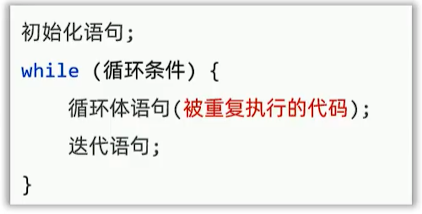

#### do-while循环

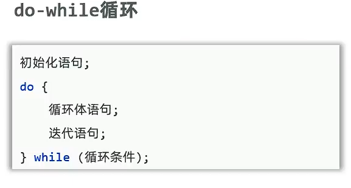

#### 死循环

可以一致执行下去的一种循环,如果没有干预不会停下来


#### 循环嵌套

循环中又包含循环


#### break, continue

- break: 跳出并结束当前所在循环的执行
- continue: 用于跳出当前循环的当次执行, 直接进入循环的下一次执行

注意:

- break: 只能用于结束所在循环, 或者结束所在switch分支的执行
- continue: 只能在循环中进行使用

## 数组

数组是一个数据容器,可用来存储一批同类型的数据

### 数组的定义方式


注意:`数据类型[] 数组名`也可以写成`数据类型 数组名[]`

### 动态初始化数组

定义数组时先不存入具体的元素值,只确定数组存储的数据类型和数组的长度


动态初始化数组元素默认值规则:


### 二维数组

数组中的每个元素都是一个一维数组, 这个数组就是二维数组


# java面向对象编程

对象是一种特殊的数据结构, 可以用来记住一个事物的数据, 从而代表该事物

1. 先设计对象的模板, 也就是对象的设计图: 类
2. 通过new关键字实例化对象, 每new一次类就得到一个新的对象

## 构造器

构造器是一种特殊方法, 不能写返回值类型, 名称必须和类名相同

``` java
public class Student {
    // 无参构造器
    public Student() {}

    //有参构造器
    public Student(String name, int age) {
        ...
    }
}
```

注意:

- 类默认就自带了一个无参构造器
- 如果为类定义了有参构造,类默认的无参构造器就没有了

## this关键字

- this就是一个变量, 可以用在方法中来拿到当前对象
- this主要用来解决变量名称冲突的问题

## 封装

### 什么是封装

- 就是用类设计对象处理某一个事物的数据时, 应该把要处理的数据, 以及处理这些数据的方法, 涉及到同一个对象中去
- 面向对象三大特征: 封装, 继承, 多态

### 封装的设计规范是什么样的

- 合理隐藏, 合理暴露

### 代码层面如何控制对象的成员公开或隐藏

- 公开成员, 可以使用`public`进行修饰
- 隐藏成员, 使用`private`进行修饰

## 实体类

是一种特殊类, 类中要满足如下需求:

1. 类中的成员变量全部私有, 并提供public修饰的getter/setter方法
2. 类中需要提供一个无参数构造器, 有参数构造器可选

## static

static叫静态, 可以修饰成员变量, 成员方法

成员变量按照有误static修饰, 分为两种:

- 静态变量(类变量): 有static修饰, 属于类, 在计算机里只有一份, 会被类的全部对象共享
- 实例变量(对象的变量): 无static修饰, 属于每个对象的

成员方法的分类:

- 静态方法: 有static修饰的成员方法, 属于类
- 实例方法: 无static修饰的成员方法, 属于对象

工具类不需要创建对象, 建议将工具类的构造器私有化

### 静态方法, 实例方法相关的注意事项

- 静态方法中可以直接访问静态成员, 不可以直接访问实例成员
- 实例方法中既可以直接访问静态成员, 也可以直接访问实例成员
- 实例方法中可以出现this关键字, 静态方法中不可以出现this关键字

## 继承

- java中提供了一个关键字extends, 用这个关键字, 可以让一个类和另一个类建立起父子关系
- 子类能继承父类的非私有成员(成员变量, 成员方法)
- 子类的对象创建是由子类, 父类共同完成的

### 权限修饰符

用来限制类中的成员(成员变量, 成员方法, 构造器)能够被访问的范围

- private 只能本类
- 缺省(default) 本类, 同一个包中的类
- protected 本类, 同一个包中的类, 子孙类
- public 任意位置

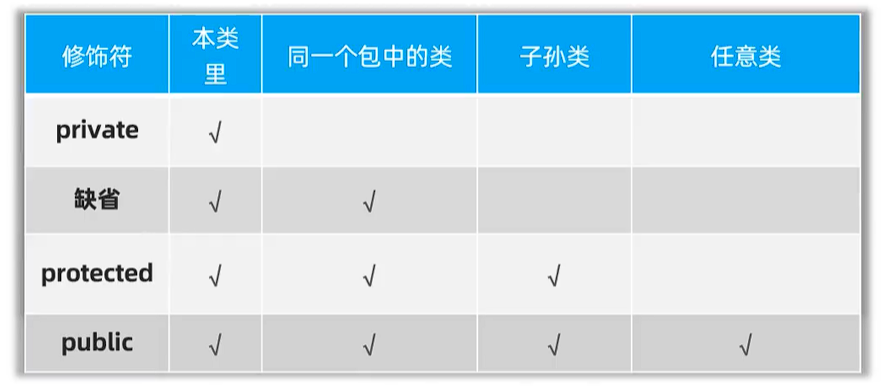

### 继承的特点

- 单继承: java是单继承模式, 一个类只能直接继承一个父类
- 多层继承: java不支持多继承, 但支持多层继承
- 祖宗类: java中所有的类都是Object类的子类
- 就近原则: 优先访问自己类中的成员(成员变量, 成员方法), 自己类中的没有才会访问父类

### 继承后子类访问成员的特点: 就近原则

1. 在子类方法中访问其他成员(成员变量, 成员方法), 是依照就近原则的
    - 先在子类局部范围找, 然后在子类成员范围找, 然后在父类成员范围找, 如果父类范围还没有找到就报错
2. 如果子父类中, 出现了重名的成员, 会优先使用子类的
    - 如果要在子类中访问父类成员可以通过`super`关键字, 指定访问父类的成员

### 方法重写

当子类觉得父类中的某个方法不好用, 或者无法满足自己的需求时, 子类可以重写一个方法名称, 参数列表一样的方法来覆盖父类的方法, 这就是方法重写

``` java
class Cat extends Animal {
    //方法重写: 方法名称, 形参列表必须一样
    @Override //方法重写的校验注解(标志): 要求方法名称和形参列表必须与被重写的方法一致, 否则报错
    public void cry() {
        System.out.println("喵喵喵");
    }
}

class Animal {
    public void cry() {
        System.out.println("咕咕嘎嘎");
    }
}
```

注意:

- 使用`Override`注解可以指定java编译器检查方法重写是否正确
- 子类重写父类方法时, 访问权限必须大于或者等于父类方法的权限(public>protected>默认)
- 重写的方法返回值类型, 必须与被重写方法的返回值类型一致, 或者范围更小
- 私有方法, 静态方法不能被重写

#### 方法重写的常见场景

- 子类重写`Object`类的`toString()`方法, 以便返回对象的内容

### 子类构造器

- 子类的全部构造器, 都会先调用父类的构造器, 再执行自己
- 默认情况下, 子类全部构造器的第一行代码都是`super()`(写不写都有), 它会调用父类的无参数构造器

### this(...)调用兄弟构造器

任意类的构造器中, 可以通过this(...)来调用该类的其他构造器

注意: super(...) this(...) 必须写在构造器的第一行, 且两者不能同时出现

## 多态

多态是在继承/实现情况下的一种现象, 表现为: 对象多态, 行为多态


### 多态的前提

有继承/实现关系; 存在父类引用子类对象; 存在方法重写

注意: 多态是对象, 行为的多态, java中的属性(成员变量)不具备多态

### 多态的好处

- 在多态形式下, 右值对象是解耦合的, 更便于扩展和维护


- 定义方法时, 使用父类类型的形参, 可以接受一切子类对象, 扩展性更强, 更便利

注意: 多态下不能使用子类的独有功能

### 多态下的类型转换问题

- 自动类型转换: 父类 变量名 = new 子类();
- 强制类型转换: 子类 变量名 = (子类) 父类变量;

注意:

- 存在继承/实现关系就可以在编译阶段进行强制类型转换, 编译阶段不会报错
- 运行时, 如果发现对象的真实类型与强转后的类型不同, 就会报类型转换异常(ClassCastException)的错误

强转前, java建议: 使用`instanceof`关键字, 判断当前对象的真实类型, 再进行强转

`p instanceof Student`

## final关键字

final关键字是最终的意思, 可以修饰: 类, 方法, 变量

- 修饰类: 该类被称为最终类, 特点是不能被继承了
- 修饰方法: 该方法被称为最终方法, 特点是不能被重写了
- 修饰变量: 该变量仅能被赋值一次

注意:

- final修饰基本类型的变量, 变量存储的数据不能被改变
- final修饰引用类型的变量, 变量存储的地址不能被改变, 但地址所指向对象的内容是可以被改变的

## 常量

- 使用了`static final`修饰的成员变量就被成为常量
- 作用: 常用于记录系统的配置信息

注意: 
- 常量名的命名建议使用大写英文单词, 多个单词使用下划线连接起来
- 程序编译后, 常量会被"宏替换": 出现常量的地方全部会被替换成字面量

## 枚举类

枚举是一种特殊类


特点:

- 枚举类中的第一行, 只能写枚举类的对象名称, 且要用逗号隔开
- 这些名称, 本质是常量, 每个常量都记住了枚举类的一个对象
- 枚举都是最终类, 不可以被继承, 枚举类都是继承java.lang.Enum类的
- 枚举类的构造器都是私有的, 因此, 枚举类对外不能创建对象

### 枚举类的常见应用场景

枚举类很适合做信息分类标志

## 抽象类

在java中有一个关键字叫: `abstract`, 意思是抽象, 可以用它来修饰类, 成员方法

- `abstract`修饰类, 这个类就是抽象类
- `abstract`修饰方法, 这个方法就是抽象方法

``` java
public abstract class A {
    //抽象方法: 必须abstract修饰, 只有方法签名, 不能有方法体
    public abstract void test();
}
```

注意:

- 抽象类中不一定要有抽象方法, 有抽象方法的类必须是抽象类
- 类有的成员: 成员变量, 方法, 构造器, 抽象类都可以有
- 抽象类不能创建对象, 仅作为一种特殊的父类, 让子类继承并实现
- 一个类继承抽象类, 必须重写完抽象类的全部抽象方法, 否则这个类也必须定义成抽象类

### 使用抽象类的好处

- 父类知道每个子类都要做某个行为, 但每个子类要做的情况不一样, 父类就定义成抽象方法, 交给子类去重写实现, 设计这样的抽象类, 就是为了更好地支持多态

## 接口

java提供了`interface`关键字用于定义接口

``` java
public interface 接口名 {
    // 成员变量(常量)
    // 成员方法(抽象方法)
}
```

注意: 

- 接口不能创建对象
- 接口是用来被类实现(implements)的, 实现接口的类成为实现类, 一个类可以同时实现多个接口
- 接口与接口可以多继承: 一个接口可以同时继承多个接口
- 一个接口继承多个接口, 如果多个接口中存在方法签名冲突, 则此时不支持多继承, 也不支持多实现
- 一个类继承了父类, 又同时实现了接口, 如果父类中和接口中有同名的方法, 实现类会优先用父类的
- 一个类实现了多个接口, 如果多个接口中存在同名的默认方法, 可以不冲突, 这个类重写该方法即可

``` java
修饰符 class 实现类类名 implements 接口1, 接口2, 接口3, ... {
    // 实现类实现多个接口, 必须重写完接口的全部抽象方法, 否则实现类需要定义为抽象类
}
```

### 接口的好处

- 弥补了类单继承的不足, 一个类同时可以实现多个接口, 使类的角色更多, 功能更强大
- 让程序可以面向接口编程, 这样程序员就可以灵活方便的切换各种业务实现(更利于程序的解耦合)

### 接口新增的三种方法

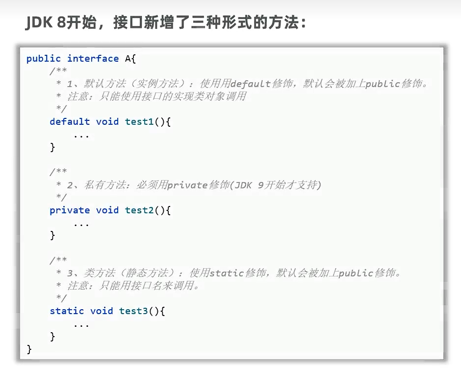

### 抽象类, 接口的区别

相同点:

1. 都是抽象形式, 都可以有抽象方法, 都不能创建对象
2. 都是派生子类形式: 抽象类是被子类继承使用, 接口是被实现类实现
3. 一个类继承抽象类, 或者实现接口, 都必须重写完他们的抽象方法, 否则自己要成为抽象类或者报错
4. 都支持多态, 都能够实现解耦合

不同点:

1. 抽象类中可以定义类的全部普通成员, 接口只能定义常量, 抽象方法(JDK8新增的三种形式)
2. 抽象类只能被类单继承, 接口可以被类多实现
3. 一个类继承抽象类就不能再继承其他类, 一个类实现了接口(还可以继承其他类或者实现其它接口)
4. 抽象类体现模板思想, 跟利于做父类实现代码的复用性
5. 接口更适合做功能的解耦合, 解耦合性更强更灵活

# java高级编程

## 代码块

代码块是类的5大成分之一(成员变量, 构造器, 方法, 代码块, 内部类)

代码块分为两种:

- 静态代码块:
    - 格式: `static{}`
    - 特点: 类加载时自动执行, 由于类只会加载一次, 所以静态代码块也只会执行一次
    - 作用: 完成类的初始化, 例如: 对静态变量的初始化赋值

- 实例代码块:
    - 格式: `{}`
    - 特点: 每次创建对象时, 执行实例代码块, 并在构造器前执行
    - 作用: 和构造器一样, 都是用来完成对象的初始化的, 例如: 对实例变量进行初始化

## 内部类

- 如果一个类定义在另一个类的内部, 这个类就是内部类
- 场景: 当一个类的内部, 包含了一个完整的事物, 且这个事物没有必要单独设计时, 就可以把这个事物设计成内部类

``` java
public class Car {
    // 内部类
    public class Engine {

    }
}
```

### 成员内部类

就是类中的一个普通成员, 类似前面我们学过的普通的成员变量, 成员方法

``` java
public class Outer {
    // 成员内部类
    public class Inner {

    }
}
```

创建对象的格式:

``` java
外部类名.内部类名 对象名 = new 外部类(...).new 内部类(...);
Outer.Inner in = new Outer().new Inner();
```

成员内部类中访问其他成员的特点:

1. 成员内部类中可以直接访问外部类的静态成员, 也可以直接访问外部类的实例成员
2. 成员内部类的实例方法中, 可以直接拿到当前寄生的外部类对象: 外部类名.this

## 静态内部类

有static修饰的内部类, 属于外部类自己持有

``` java
public class Outer {
    // 静态内部类
    public static class Inner {

    }
}
```

``` java
外部类名.内部类名 对象名 = new 外部类.内部类(...);

Outer.Inner in = new Outer.Inner();
```

## 局部内部类

局部内部类定义在方法, 代码块, 构造器等执行体中

``` java
public class Test {
    public static void main(String[] args) {

    }

    public static void go() {
        class A {

        }

        abstract class B {

        }

        interface C {

        }
    }
}
```

## 匿名内部类

- 匿名内部类是一种特殊的局部内部类
- 所谓匿名指的是程序员不需要为这个类命名, 默认有个隐藏名字

``` java
new 类或接口(参数值...) {
    类体(一般是方法重写);
};
```

特点: 匿名内部类本质就是一个子类, 并会立即创建出一个子类对象

作用: 用于更方便地创建一个子类对象

### 匿名内部类在开发中的常见形式

通常作为一个对象参数传输给方法

例如, 学生和老师参加游泳比赛:

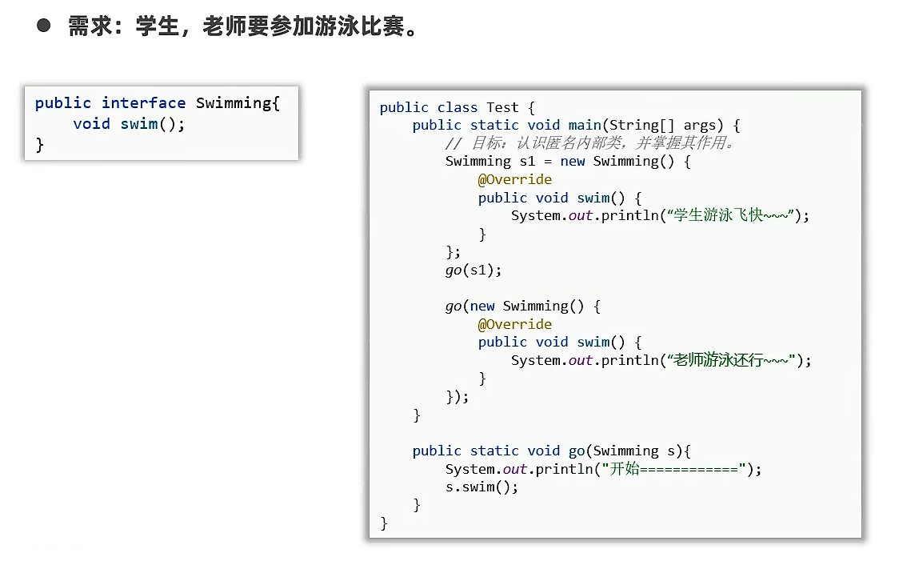

## java函数式编程

### Lambda表达式

使用Lambda函数替代某些匿名内部类对象, 从而让程序代码更简洁, 可读性更好

- JDK8开始新增的一种语法形式, 它表示函数
- 可以用于替代某些匿名内部类对象, 从而让程序更简洁, 可读性更好


``` java
(被重写方法的形参列表) -> {
    被重写方法的方法体代码
}
```

注意: Lambda表达式只能替代函数式接口的匿名内部类

- 函数式接口是指有且仅有一个抽象方法的接口
- 未来遇到的大部分函数式接口, 上面都可能会有一个@FunctionalInterface的注解, 该注解用于约束当前接口必须是函数式接口

#### Lambda表达式省略规则

作用: 用于进一步简化Lambda表达式的写法

具体规则:

- 参数类型全部可以省略不写
- 如果只有一个参数, 参数类型省略的同时"()"也可以省略, 但多个参数不能省略"()"
- 如果Lambda表达式中只有一行代码, 大括号可以不写, 同时要省略分号";", 如果这行代码是return语句, 也必须去掉return

### 方法引用

#### 静态方法引用

语法: `类名::静态方法`

使用场景:

- 如果某个Lambda表达式里只是调用一个静态方法, 并且"->"前后参数的形式一致, 就可以使用静态方法引用

#### 实例方法引用

语法: `对象名::实例方法`

使用场景:

- 如果某个Lambda表达式里只是通过对象名称调用一个实例方法, 并且"->"前后参数的形式一致, 就可以使用实例方法引用

#### 特定类型方法引用

语法: `特定类的名称::方法`

使用场景:

- 如果某个Lambda表达式里只是调用一个特定类型的实例方法, 并且前面参数列表中的第一个参数是作为方法的主调, 后面的所有参数都是作为该实例方法的入参的, 此时就可以使用特定类型的方法引用

#### 构造器引用

语法: `类名::new`

使用场景:

- 如果某个Lambda表达式里只是在创建对象, 并且"->"前后参数情况一致, 就可以使用构造器引用

# java常用API

## String

String代表字符串, 它的对象可以封装字符串数据, 并提供了很多方法完成对字符串的处理

### String创建字符串对象的方式

1. java程序中的所有字符串文字(例如"abc")都为此类的对象

``` java
String name = "李华";
String schoolName = "剑桥大学"
```

2. 调用String类的构造器初始化字符串对象

| 构造器                         | 说明                                   |
| ------------------------------ | -------------------------------------- |
| public String()                | 创建一个空白字符串对象, 不包含任何内容 |
| public String(String original) | 根据传入的字符串内容来创建字符串对象   |
| public String(char[] chars)    | 根据字符数组的内容来创建字符串对象     |
| public String(byte[] bytes)    | 根据字节数组的内容来创建字符串对象     |

## String提供的常用方法

| 方法名                                                               | 说明                                                            |
| -------------------------------------------------------------------- | --------------------------------------------------------------- |
| public int length()                                                  | 获取字符串的长度返回(就是字符个数)                              |
| public char charAt(int index)                                        | 获取某个索引位置处的字符返回                                    |
| public char[] toCharArray():                                         | 将当前字符串转换成字符数组返回                                  |
| public boolean equals(Object anObject)                               | 判断当前字符串与另一个字符串的内容是否一致, 一致返回true        |
| public boolean equalsIgnoreCase(String anotherString)                | 判断当前字符串与另一个字符串的内容是否一样(忽略大小写)          |
| public String substring(int beginIndex, int endIndex)                | 根据开始和结束索引进行截取, 得到新的字符串(包前不包后)          |
| public String substring(int beginIndex)                              | 从传入的索引处截取, 截取到末尾, 得到新的字符串返回              |
| public String replace(CharSequence target, CharSequence replacement) | 使用新值, 将字符串中的旧值替换, 得到新的字符串                  |
| public boolean contains(CharSequence s)                              | 判断字符串中是否包含了某个字符串                                |
| public boolean startsWith(String prefix)                             | 判断字符串是否以某个字符串内容开头, 开头返回true, 否则返回false |
| public String[] split(String regex)                                  | 把字符串按照某个字符串内容分割, 并返回字符串数组                |

## ArrayList集合

| 构造器             | 说明                 |
| ------------------ | -------------------- |
| public ArrayList() | 创建一个空的集合对象 |

| 常用方法名                            | 说明                                   |
| ------------------------------------- | -------------------------------------- |
| public boolean add(E e)               | 将指定的元素添加到此集合的末尾         |
| public void add(int index, E element) | 在此集合中的指定位置插入指定的元素     |
| public E get(int index)               | 返回指定索引处的元素                   |
| public int size()                     | 返回集合中的元素个数                   |
| public E remove(int index)            | 删除指定索引处的元素, 返回被删除的元素 |
| public boolean remove(Object o)       | 删除指定的元素, 返回删除是否成功       |
| public E set(int index, E element)    | 修改指定索引处的元素, 返回被修改的元素 |

# javaGUI编程

- GUI, 全程Graphical User Interface, 是指图形用户界面
- 通过图形元素(如窗口, 按钮, 文本框等)与用户进行交互
- 与命令行界面(CLI)相比, GUI更加只管, 友好

## java的GUI编程包

- AWT(Abstract Window Toolkit)
    - 提供了一组原生的GUI组件, 依赖于操作系统的本地窗口系统
- Swing
    - 基于AWT, 提供了更丰富的GUI组件, 轻量级组件, 不依赖于本地窗口系统

### 常用的Swing组件

- JFrame: 窗口
- JPanel: 用于组织其他组件的容器
- JButton: 按钮组件
- JTextField: 输入框
- JTable: 表格
- ...

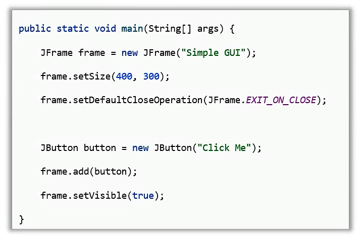

### 常见的布局管理器

- 布局管理器(Layout Manager)它们可以决定组件在容器中的布局方式, 避免了手动设置每个组件的位置和大小, 从而简化GUI设计过程

常见布局管理器:

- FlowLayout
- BorderLayout
- GridLayout
- BoxLayout

#### FlowLayout

简介: FlowLayout是最简单的布局管理器, 它按照水平方向从左到右排列组件, 当一行排满时, 自动换到下一行

特点: 

- 默认居中对齐可以设置为左对齐或者右对齐
- 适用于需要简单排列的场景

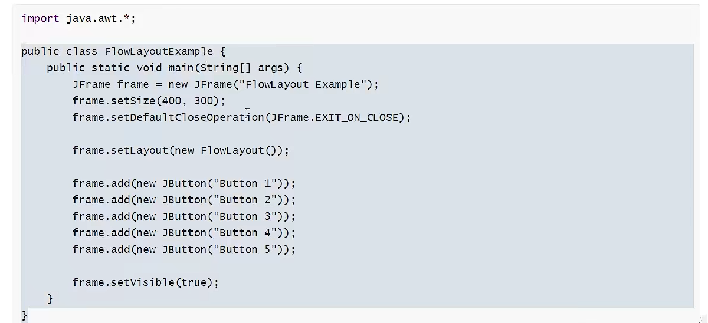

#### BorderLayout

简介: BorderLayout将容器划分为五个区域: 东, 南, 西, 北, 中(East, South, West, North, Center)每个区域只能添加一个组件, 未添加组件的区域保持空白

特点:

- 适用于需要在特定区域布局组件的场景
- 中间区域会占据所有剩余的空间

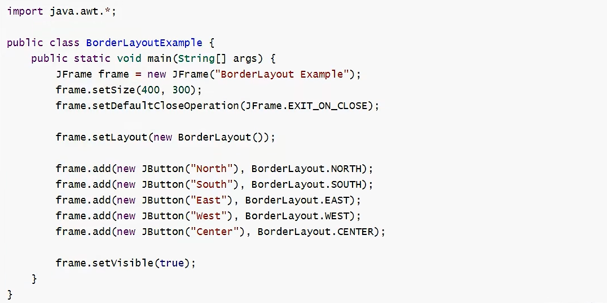

#### GridLayout

简介: GridLayout将容器划分为等大小的网络, 每个网络中可以添加一个组件, 所有组件大小相同

特点: 

- 适用于需要均匀排列组件的场景
- 行和列的数量可以指定

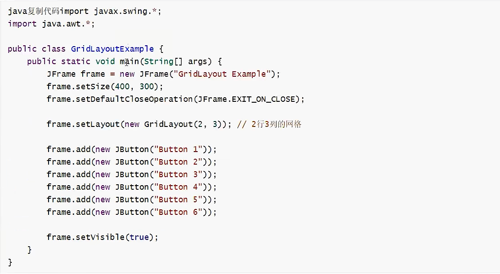

#### BoxLayout

简介: BoxLayout能够沿着单一轴线(X轴或Y轴)排列组件. 可以创建水平(X轴)或垂直(Y轴)排列的布局

特点: 

- 适用于需要沿单一方向排列组件的场景
- 可以通过添加垂直或水平间隙(Glue, Strut)来调整组件间隙

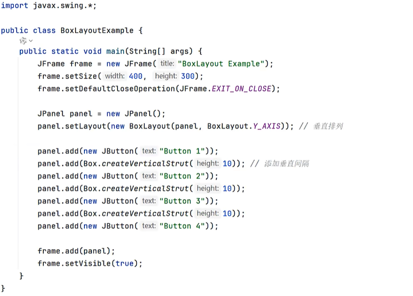

## 事件处理

GUI编程中, 事件的处理是通过事件监听器(Event Listener)来完成的

常用的事件监听器对象

- 点击事件监听器 ActionListener
- 按键事件监听器 KeyListener
- 鼠标行为监听器 MouseListener
- ...

### 事件的几种常见写法

1. 直接提供实现类, 用于创建事件监听对象
2. 直接使用匿名内部类的对象, 代表事件监听对象
3. 自定义窗口, 让窗口对象实现事件接口

# 异常

## java异常体系

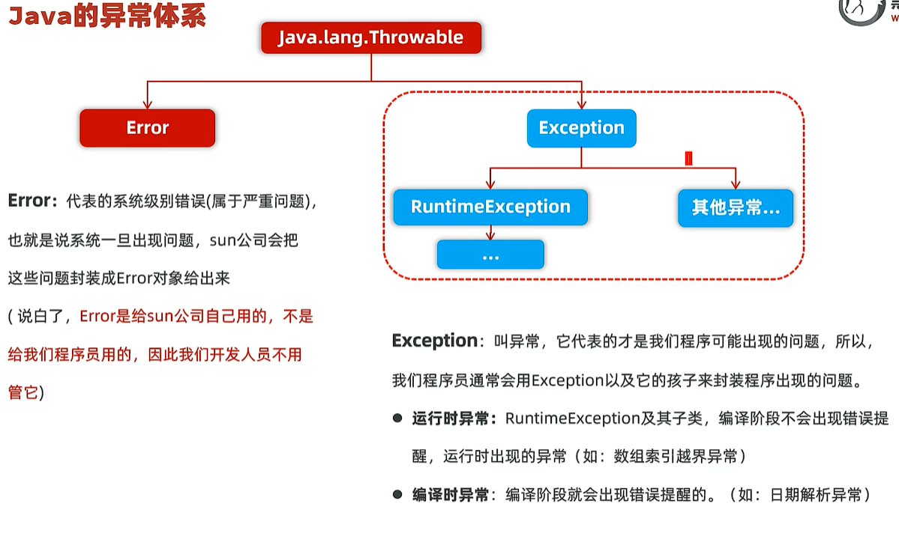

## 异常的基本处理

抛出异常(throws)

- 在方法上使用throws关键字, 可以将方法内部出现的异常抛出去给调用者处理

``` java
方法 shrows 异常1, 异常2, 异常3, ... {
    ...
    throw ...
}
```

捕获异常(try...catch)

- 直接捕获程序出现的异常

``` java
try {
    // 监视可能出现的异常
}catch(异常类型1 变量) {
    // 处理异常
}catch(异常类型2 变量) {
    // 处理异常
}...
```

## 异常的作用

1. 可以用来定位程序bug的关键信息
2. 可以作为方法内部的一种特殊返回值, 以便通知上层调用者, 方法的执行问题

## 自定义异常

java无法为这个世界上全部的问题都提供异常类来代表; 如果企业自己的某种问题, 想通过异常来表示, 就需要自定义异常类

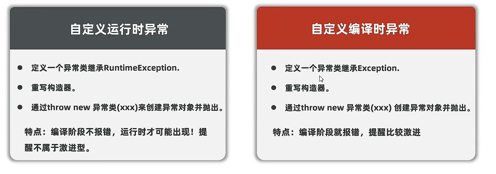

## 异常处理方案

1. 底层异常异常层层往上抛出, 最外层捕获异常, 记录下异常信息, 并响应适合用户观看的信息进行提示
2. 最外层捕获异常后, 尝试重新修复

# 泛型

- 定义类, 接口, 方法时, 同时声明了一个或者多个类型变量(如:\<E\>)成为泛型类, 泛型接口, 泛型方法, 它们统称为泛型

``` java
 public class ArrayList<E> {
    ...
}
```

- 作用: 泛型提供了在编译阶段约束所能操作的数据类型, 并自动检查的能力,这样可以避免强制类型转换, 以及可能出现的异常
- 泛型的本质: 把具体的数据类型作为参数传给类型变量

## 泛型类

``` java
修饰符 class 类名<类型变量, 类型变量, ...> {
    ...
}
```

- 注意: 类型变量建议用大写的英文字母, 常用的有: E, T, K, V等

## 泛型接口

``` java
修饰符 interface 接口名<类型变量, 类型变量, ...> {
    ...
}
```

- 注意: 类型变量建议用大写的英文字母, 常用的有: E, T, K, V等

## 泛型方法, 通配符, 上下限

### 泛型方法

``` java
修饰符<类型变量, 类型变量, ...> 返回值类型 方法名(形参列表) {
    ...
}
```

### 通配符

- 就是"?", 可以在"使用泛型"的时候代表一切类型; E T K V是在定义泛型的时候使用

### 泛型的上下限

- 泛型上限: `?extends Car`: 通配符能接受的必须是Car或者其子类
- 泛型下限: `?super Car`: 通配符能接收的必须是Car或者其父类

## 泛型支持的类型

- 泛型不支持基本数据类型, 只能支持对象类型(引用数据类型)

### 包装类

- 包装类就是把基本的数据类型包装成对象的类型

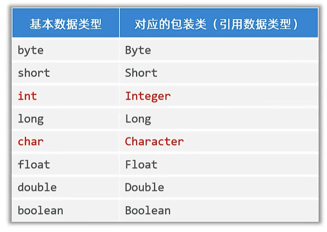

- 自动装箱: 基本数据类型可以自动转换为包装类型
- 自动拆箱: 包装类型可以自动转换为基本数据类型

### 包装类具备的其他功能

- 可以把基本类型的数据转换成字符串类型

``` java
public static String toString(double d)
public String toString()
```

- 可以把字符串类型的数值转换成数值本身对应的真实数据类型

``` java
public static int parseInt(String s)
public static Integer valueOf(String s)
```

# 集合

集合是一种容器, 用来装数据的, 类似于数组, 但集合的大小可变, 开发中也非常常用

## 集合体系结构

- Collection代表单列集合, 每个元素(数据)只包含一个值
- Map代表双列集合, 每个元素包含两个值(键值对)

## Collection集合特点

- List系列集合: 添加的元素是有序, 可重复, 有索引
    - ArrayList, LinkedList: 有序, 可重复, 有索引
- Set系列集合: 添加的元素是无序, 不重复, 无索引
    - HashSet: 无序, 不重复, 无索引
    - LinkedHashSet: 有序, 不重复, 无索引
    - TreeSet: 按照大小默认升序排序, 不重复, 无索引

### Collection的常用功能

- Collection是单列集合的祖宗, 它规定的方法(功能)是全部单列集合都会继承的

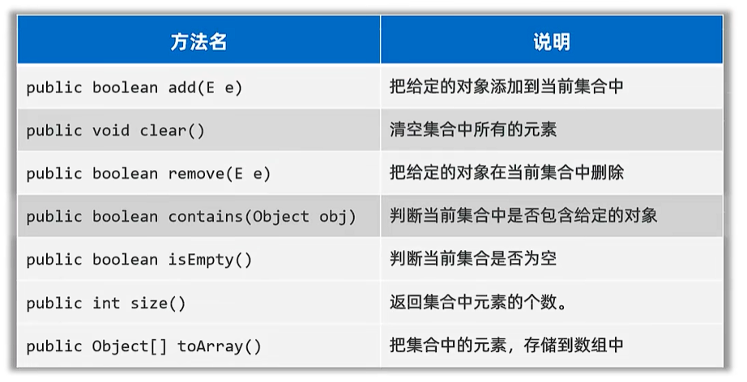

### Collection的遍历方式

#### 迭代器遍历

- 迭代器是用来遍历集合的专用方式(数组没有迭代器), 在java中迭代器的代表是`Iterator`

Collection集合获取迭代器的方法

| 方法名称                 | 说明                                                             |
| ------------------------ | ---------------------------------------------------------------- |
| `Iterator<E> Iterator()` | 返回集合中的迭代器对象, 该迭代器对象默认指向当前集合的第一个元素 |

Iterator迭代器中的常用方法

| 方法名称            | 说明                                                      |
| ------------------- | --------------------------------------------------------- |
| `boolean hasNext()` | 询问当前位置是否有元素存在, 存在返回true, 不存在返回false |
| `E next()`          | 获取当前位置的元素, 并同时将迭代器对象指向下一个元素处    |

#### 增强for循环遍历

格式:

``` java
for (元素的数据类型 变量名 : 数组或者集合) {
    ...
}
```

- 增强for可以用来遍历集合或者数组
- 增强for遍历集合, 本质就是迭代器遍历集合的简化写法

#### Lambda表达式遍历

- 得益于JDK8开始的新技术Lambda表达式, 提供了一种更简单, 更直接的方式来遍历集合

需要使用Collection的如下方法来完成:

| 方法名称                                         | 说明               |
| ------------------------------------------------ | ------------------ |
| default void forEach(Consumer<? super T> action) | 结合lambda遍历集合 |

### List集合体系

List系列集合特点: 有序, 可重复, 有索引

- ArrayList: 有序, 可重复, 有索引
- LinkedList: 有序, 可重复, 有索引

List集合特有的方法:

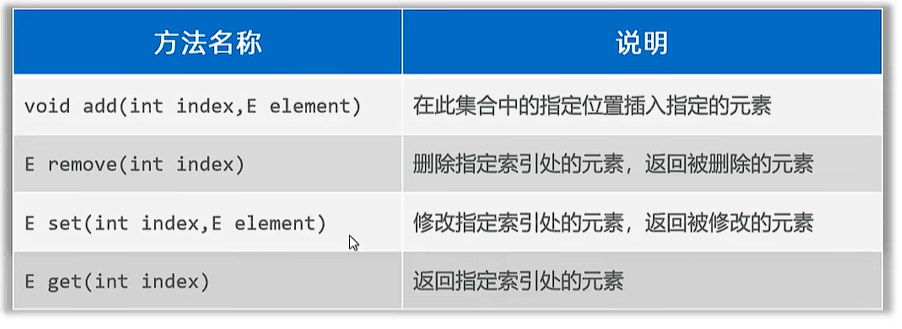

#### ArrayList和LinkedList的区别

- ArrayList底层是基于顺序表存储数据的
- LinkedList底层是基于双链表存储数据的

数组的特点:

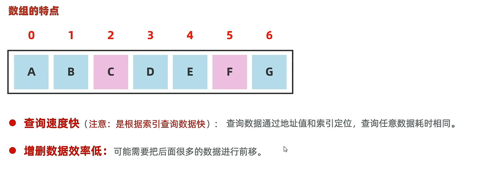

链表的特点:

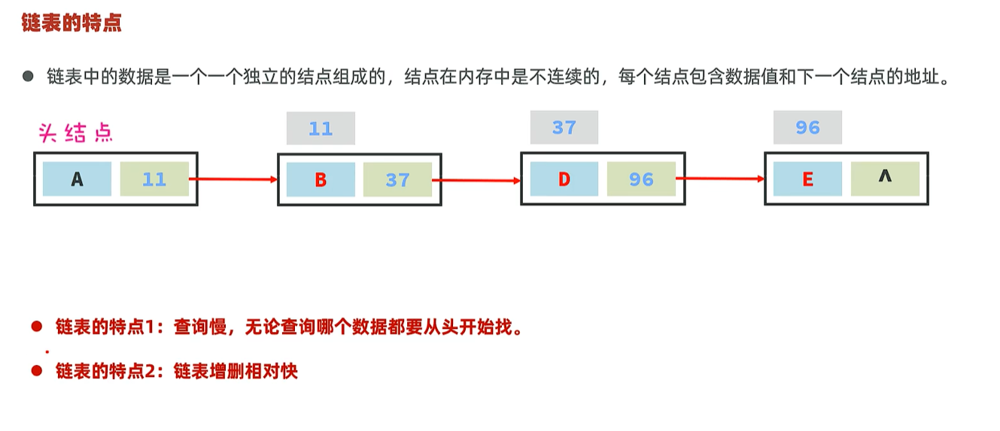

LinkedList的特有方法:

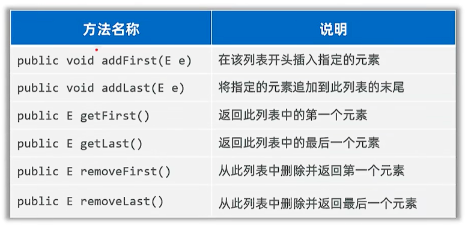

### set集合体系

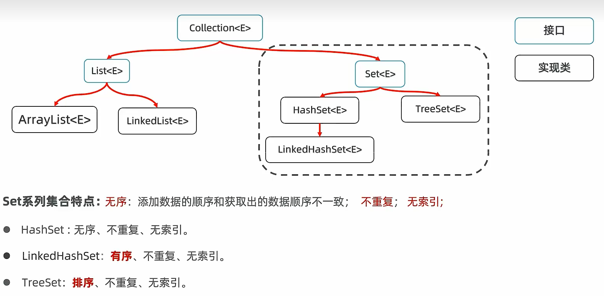

注意: Set要用到的常用方法, 基本上就是Collection提供的, 自己几乎没有额外新增的常用功能 

#### HashSet集合

HashSet是基于哈希表存储数据的

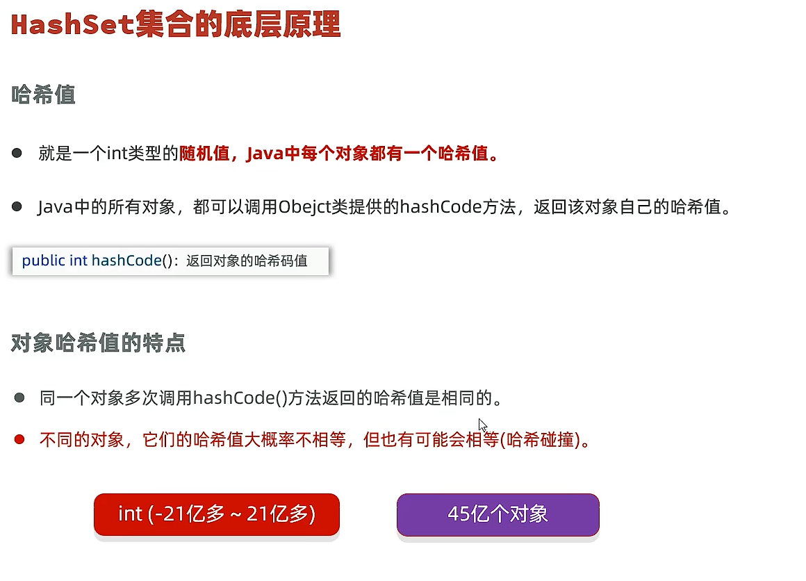

哈希表:

- JDK8之前, 哈希表 = 数组 + 链表
- JDK8开始, 哈希表 = 数组 + 链表 + 红黑树
- 哈希表是一种增删改查数据, 性能都较好的数组结构

#### LinkedHashSet集合

LinkedHashSet的底层原理

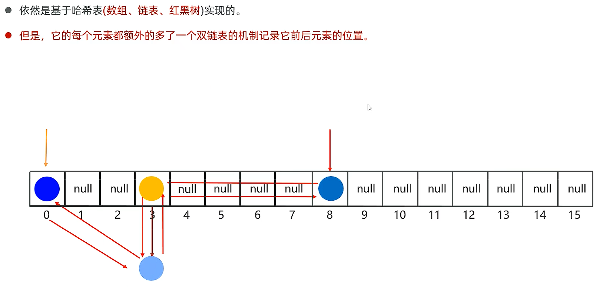

#### TreeSet集合

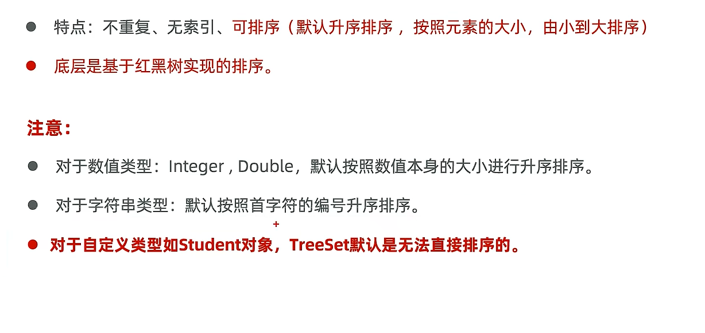

#### 自定义排序规则

- TreeSet集合存储自定义类型的对象时, 必须指定排序规则, 支持如下两种方式来指定比较规则

1. 让自定义的类(如学生类)实现`Comparable`接口, 重写里面的`compareTo`方法来指定比较规则
2. 通过调用TreeSet集合有参数构造器, 可以设置Comparator对象(比较器对象, 用于指定比较规则)
`public TreeSet(Comparator<? super E> cpmparator)`

### 总结

1. 如果希望记住元素的添加顺序, 需要存储重复的元素, 又要频繁的根据索引查询数据
   - 用ArrayList集合(有序, 可重复, 有索引), 底层基于数组.(常用)
2. 如果希望记住元素的添加顺序, 且增删首尾数据的情况较多
   - 用LinkedList集合(有序, 可重复, 有索引), 底层基于双链表. 
3. 如果不在意元素顺序, 也没有重复元素需要存储, 只希望增删改查都快
   - 用HashSet集合(无序, 不重复, 无索引), 底层基于哈希表实现.(常用) 
4. 如果希望记住元素的添加顺序, 也没有重复元素需要存储, 且希望增删改查都快
   - 用LinkedHashSet集合(有序, 不重复, 无索引), 底层基于哈希表和双链表.
5. 如果要对元素进行排序, 也没有重复元素需要存储, 且希望增删改查都快
   - 用TreeSet集合, 基于红黑树实现

## Map集合

- Map集合也被叫做"键值对集合", 格式: {Key1 = value1, key2 = value2, ...}
- Map集合的所有键是不允许重复的, 但值可以重复, 键和值是一一对应的, 每一个键只能找到自己对应的值

### Map集合的体系

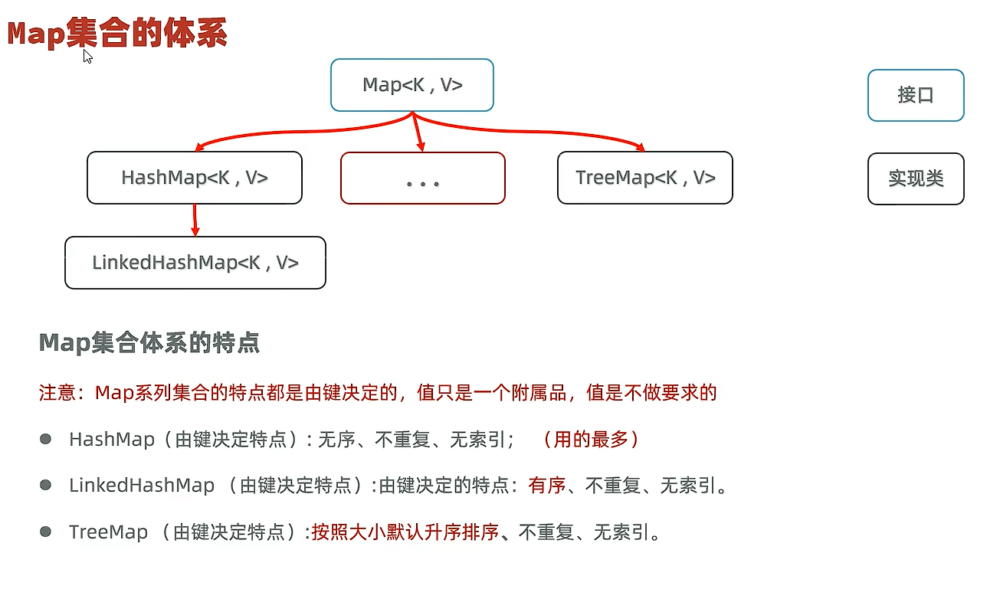

### Map集合的常用方法

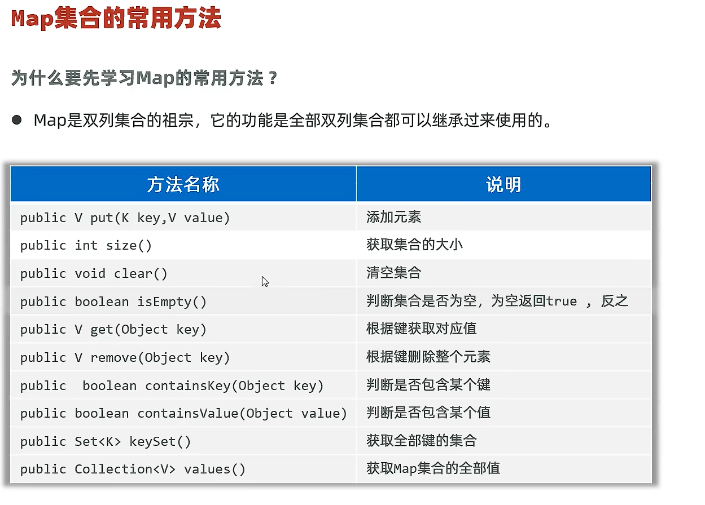

### Map集合的遍历方式

1. 键找值

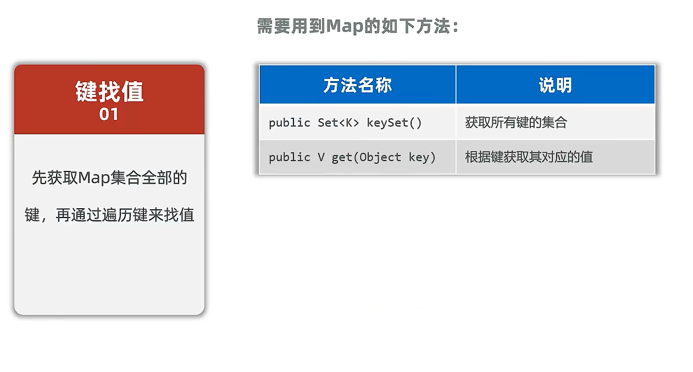

2. 键值对

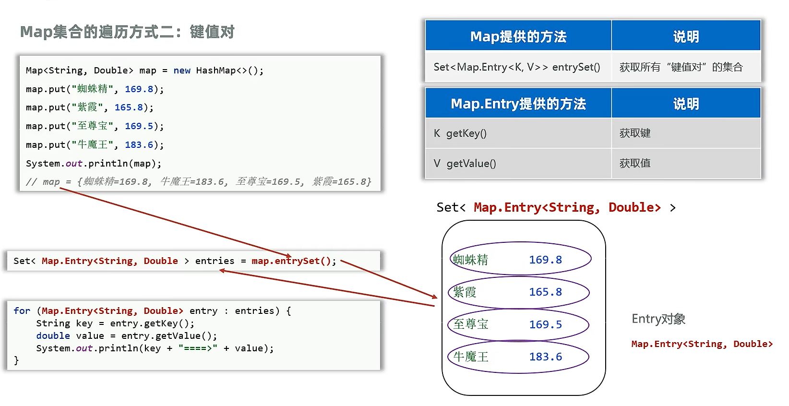

3. Lambda表达式

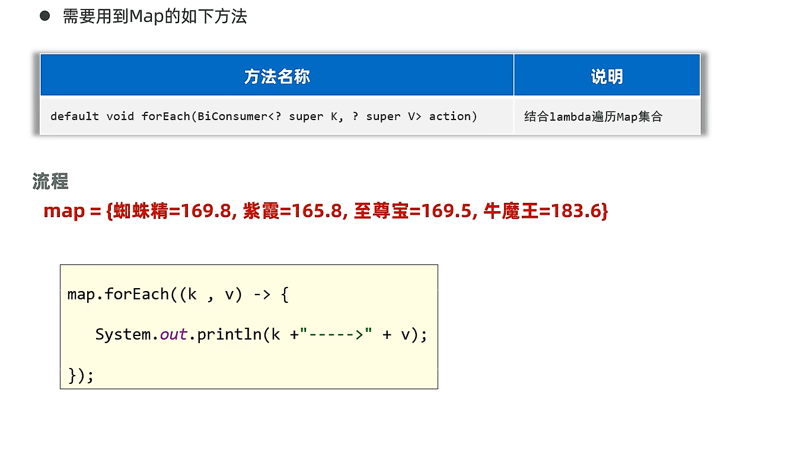

### Map集合的实现类

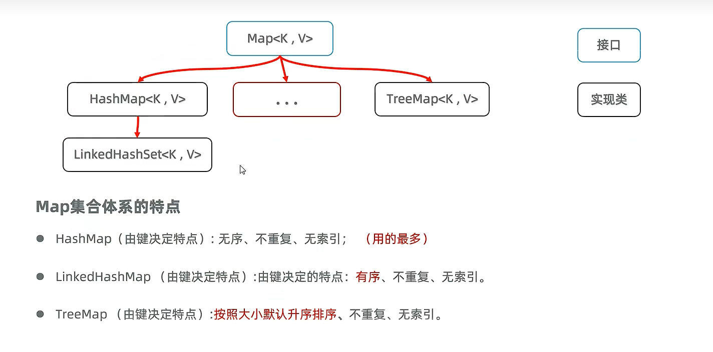

#### HashMap集合的底层原理:

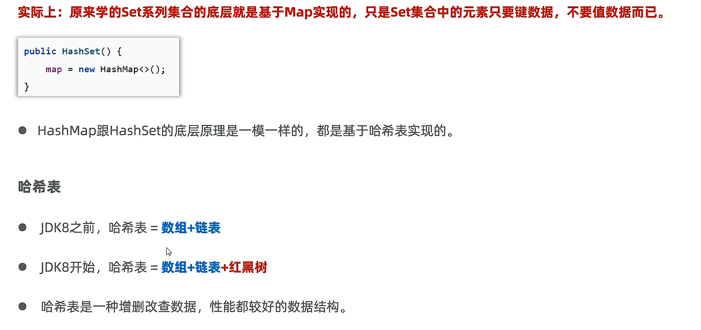

#### TreeMap的使用


# Stream流

- 是Jdk8开始新增的一套API(java.util.stream.*), 可以用于操作集合或者数组的数据
- 优势: Stream流大量结合了Lambda的语法风格来变成, 功能强大, 性能高效, 代码简洁, 可读性好

## Stream流的使用步骤


## 获取Stream流


## Stream流常用中间方法

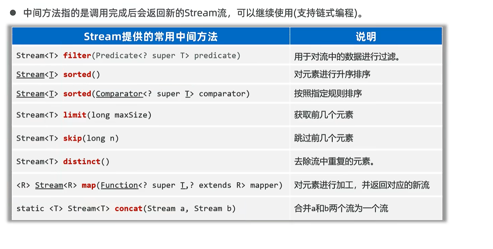

## Stream流常用终结方法

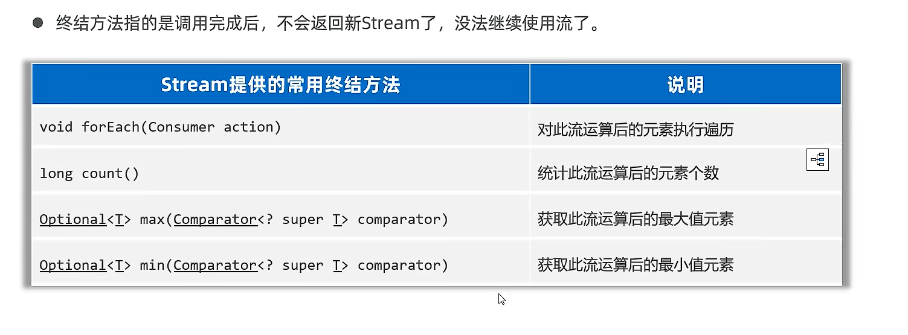

### 收集Stream流

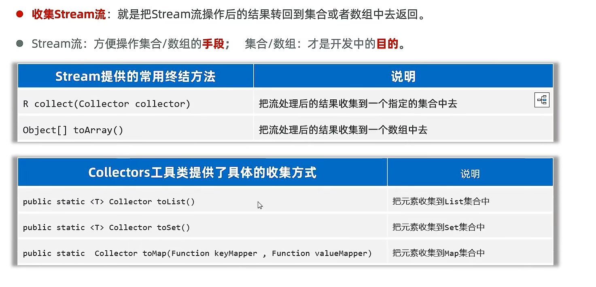

# 方法中的可变参数

- 可变参数是一种特殊形参, 定义在方法, 构造器的形参列表里, 格式是: `数据类型...参数名称;`

## 可变参数的特点和好处

- 特点: 可以不传数据给它; 可以串一个或者同时传多个数据给它; 也可以传一个数组给它
- 好处: 常常用来灵活地接受数据

## 可变参数的注意事项

- 可变参数在方法内部就是一个数组
- 一个形参列表中可变参数只能有一个
- 可变参数必须放在形参列表的最后面

# Collections工具类

Collections是一个用来操作集合的工具类

## Collections提供的常用静态方法

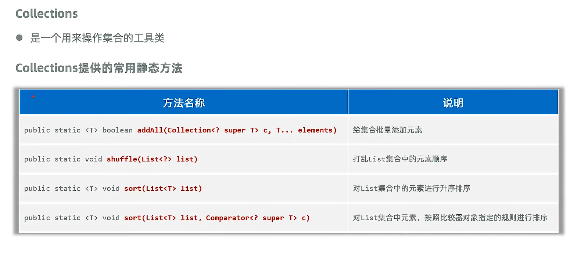

# File-IO流

## File

- File是java.io.包下的类, File类的对象, 用于代表当前操作系统的文件(可以是文件或文件夹)
- File类的对象可以代表文件/文件夹, 并可以调用其提供的方法对象文件进行操作

### 创建File类的对象

| 构造器                                     | 说明                                           |
| ------------------------------------------ | ---------------------------------------------- |
| `public File(String pathname)`             | 根据文件路径创建文件对象                       |
| `public File(String parent, String child)` | 根据父路径和子路径名字创建文件对象             |
| `public File(File parent, String child)`   | 根据父路径对应文件对象和子路径名字创建文件对象 |

注意: 

- File类只能对文件本身进行操作, 不能读写文件里面存储的数据
- File对象既可以代表文件, 也可以代表文件夹
- File封装的对象仅仅是一个路径名, 这个路径可以是存在的, 也可以是不存在的

### File提供的判断文件类型, 获取文件信息功能


### File提供的创建和删除文件的方法

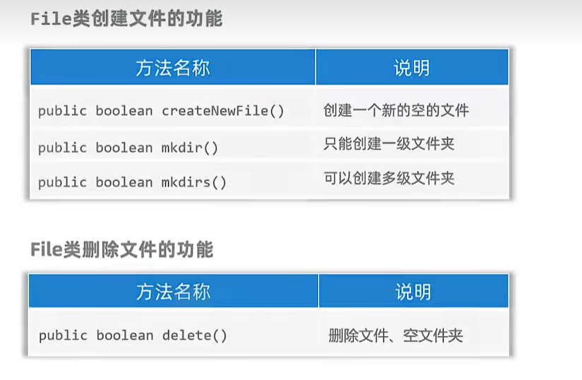

注意: delete方法默认只能删除文件和文件夹, 删除后的文件不会进入回收站

### File提供的遍历文件夹的方法

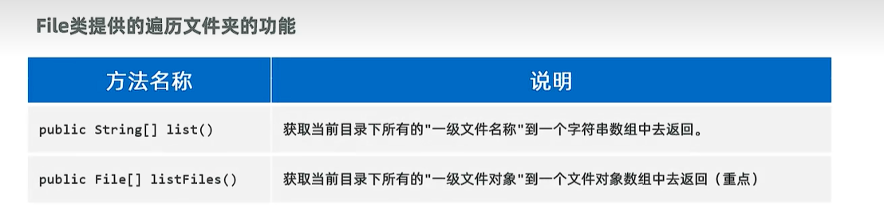

使用listFile方法时的注意事项:

- 当主调是文件, 或者路径不存在时, 返回null
- 当主调是空文件夹时, 返回一个长度为0的数组
- 当主调是一个有内容的文件夹时, 将里面所有一级文件和文件夹的路径放在File数组中返回
- 当主调是一个文件夹, 且里面有隐藏文件时, 将里面所有文件和文件夹的路径放在File数组中返回, 包含隐藏文件
- 当主调是一个文件夹, 但是没有权限访问该文件夹时, 返回null

## 常见字符集

### 标准ASCII字符集

- ASCII(American Standard Code for Information Interchange): 美国信息交换标准代码, 包括了英文, 符号等
- 标准ASCII使用1个字节存储一个字符, 首位是0, 因此总共可以表示128个字符

### GBK(汉字内码扩展规范, 国标)

- 汉字编码字符集, 包含了2万多个汉字等字符, GBK中一个中文字符编码成两个字节的形式存储

注意: 

- GBK兼容了ASCII字符集
- GBK规定汉字的第一个字节的第一位必须是1

### Unicode字符集(统一码, 也叫万国码)

- Unicode是国际组织制定的, 可以容纳世界上所有文字, 符号的字符集

### UTF-8字符集

- 是Unicode字符集的一种编码方案, 采取可变长度编码方案, 共分四个长度区:1个字节, 2个字节, 3个字节, 4个字节
- 英文字符, 数字等只占1个字节(兼容标准ASCII编码), 汉字字符占用3个字节

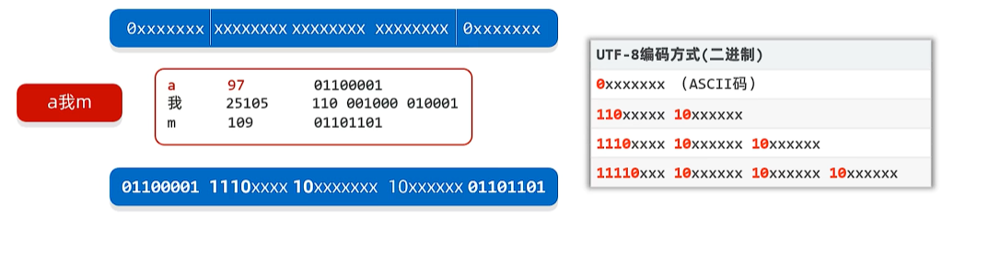

注意: 技术人员在开发时都应该使用UTF-8编码

### 总结

- ASCII字符集: 只有英文, 数字, 符号等, 占1个字节
- GBK字符集: 汉字占2个字节, 英文, 数字占1个字节
- UTF-8字符集: 汉字占3个字节, 英文, 数字占1个字节

注意:

- 字符编码时使用的字符集, 和解码时使用的字符集必须一致, 否则会出现乱码
- 英文, 数字一般不会乱码, 因为很多字符集都兼容了ASCII编码

## 使用程序对字符进行编码和解码的操作


## IO流

### IO流的分类

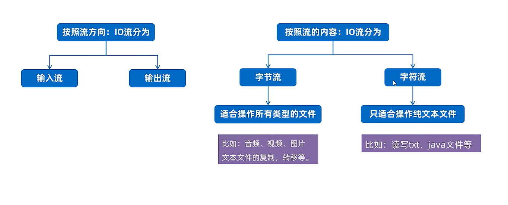

### IO流的体系

1. 字节输入流 `InputStream` (读字节数据)
2. 字节输出流 `OutputStream` (写字节数据)
3. 字符输入流 `Reader` (读字符数据)
4. 字符输出流 `Writer` (写字符数据)

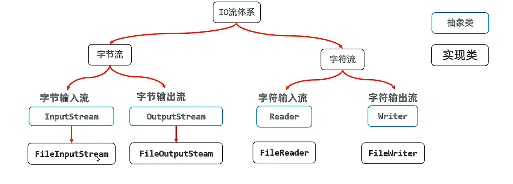

### FileInputStream(文件字节输入流)

- 作用: 以内存为基准, 可以把磁盘文件中的数据以字节的形式读入到内存中去

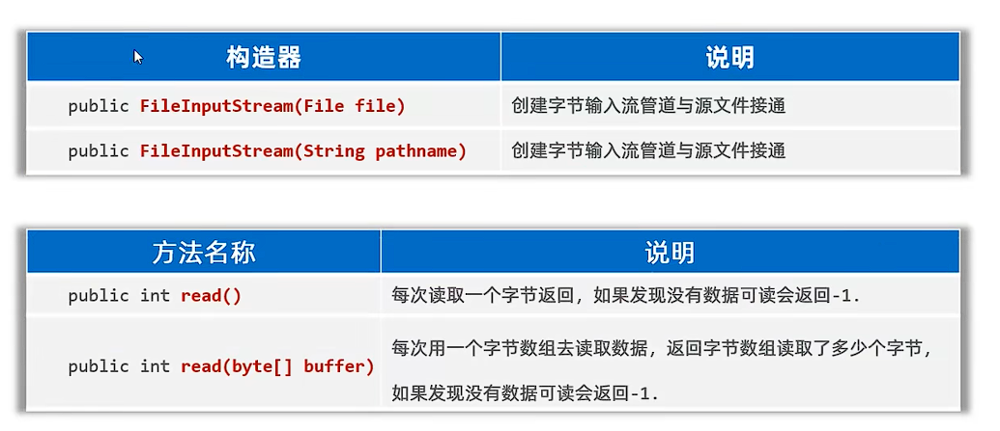

注意:

- 使用FileInputStream每次读取一个字节, 读取性能较差, 并且读取汉字输出会乱码
- 使用FileInputStream每次读取多少个字节, 读取性能得到了提升, 但读取汉字输出还是会乱码

使用字节流读取中文如何保证输出不乱码?
- 定义一个与文件一样大的字节数组, 一次性读取完文件的全部字节

#### 一次读取完全部字节

- Java官方为InputStream提供了如下方法, 可以直接把文件的全部字节读取到一个字节数组中返回

| 方法名称                                          | 说明                                                             |
| ------------------------------------------------- | ---------------------------------------------------------------- |
| `public byte[] readAllBytes() throws IOException` | 直接将当前字节输入流对应的文件对象的字节数据装到一个字节数组返回 |

注意: 

- 如果文件过大, 创建的字节数组也会过大, 可能引起内存溢出
- 读取文本适合用字符流; 字节流适合做数据的转移, 比如文件复制

### FileOutputStream文件字节输出流

作用: 以内存为基准, 把内存中的数据以字节的形式写出到文件中去

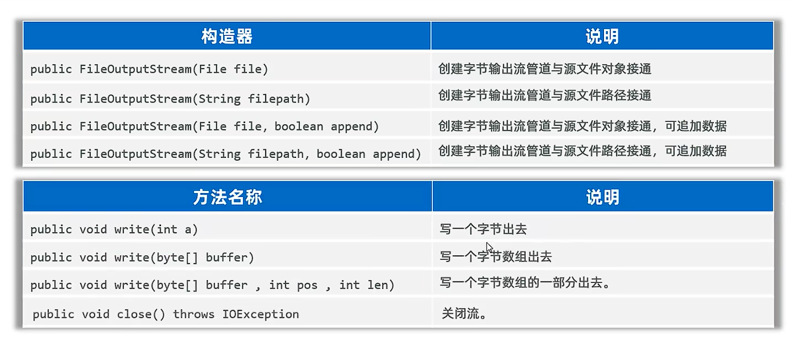

### 资源释放

资源释放方案:

#### try-catch-finally

``` java
try {
    ...
    ...
} catch (IOException e) {
    e.printStackTrace();
} finally {
    ...
}
```

- finally代码区的特点: 无论try中的程序是正常执行了还是出现了异常, 最后都一定会执行finally区, 除非JVM终止
- 作用: 一般用于在程序执行完成后进行资源的释放操作

#### try-with-resource

JDK7开始提供了更简单的资源释放方案: try-with-resource

``` java
try (定义资源1; 定义资源2; ...) {
    可能出现异常的代码;
} catch (异常类名 变量名) {
    异常处理代码;
}
```

该资源使用完毕后, 会自动调用其close()方法, 完成对资源的释放

- ()中只能放资源, 否则报错
- 资源一般指的是实现了AutoCloseable接口

``` java
public abstract class InputStream implements Closeable {}
public abstract class OutputStream implements Closeable, Flushable {}
public interface Closeable extends AutoCloseable {}
```

### FileReader文件字符输入流

作用: 以内存为基准, 可以把文件中的数据以字符的形式读入到内存中去

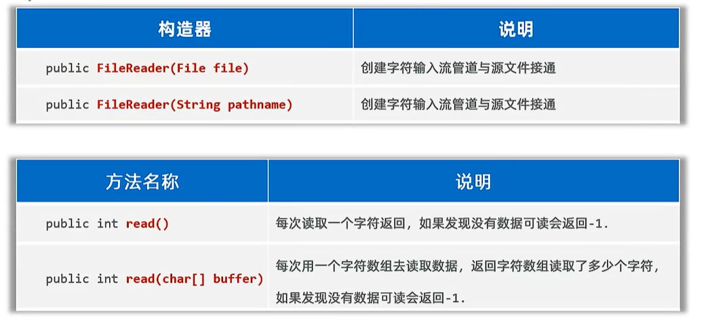

### FileWriter文件字符输出流

作用: 以内存为基准, 把内存中的数据以字符的形式写出到文件中去

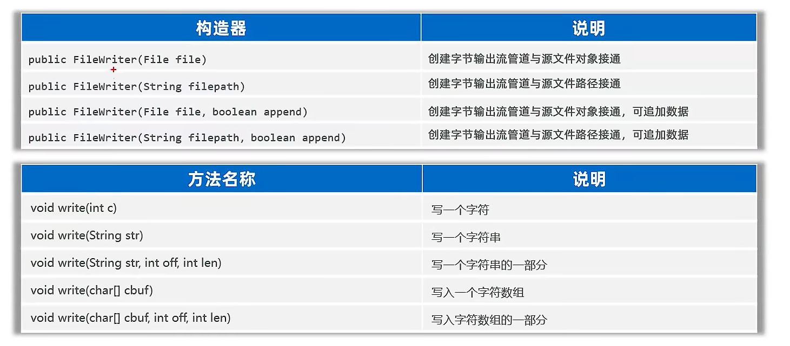

注意: 字符输出流写出数据后, 必须刷新流, 或者关闭流, 写出去的数据才能生效

| 方法名称                                 | 说明                                           |
| ---------------------------------------- | ---------------------------------------------- |
| `public void flush() throws IOException` | 刷新流, 就是将内存中缓存的数据立即写到文件中去 |
| `public void close() throws IOException` | 关闭流的操作, 包含了刷新                       |

### 缓冲流

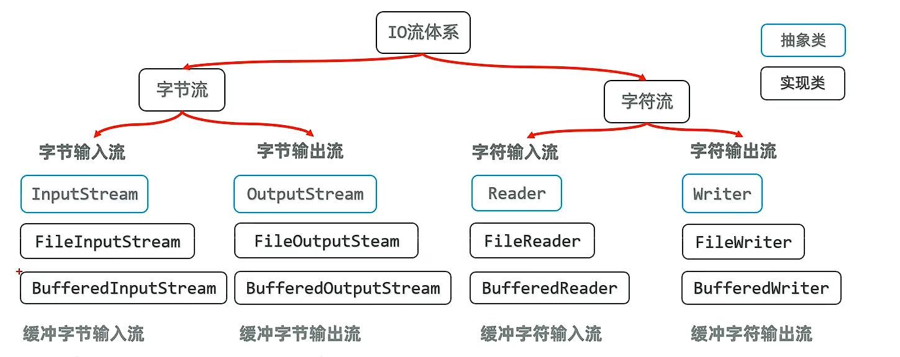

#### BufferedInputStream缓冲字节输入流

作用: 可以提高字节输入流读取数据的性能
原理: 缓冲字节输入流自带了8KB缓冲池; 缓冲字节输出流也自带了8KB缓冲池

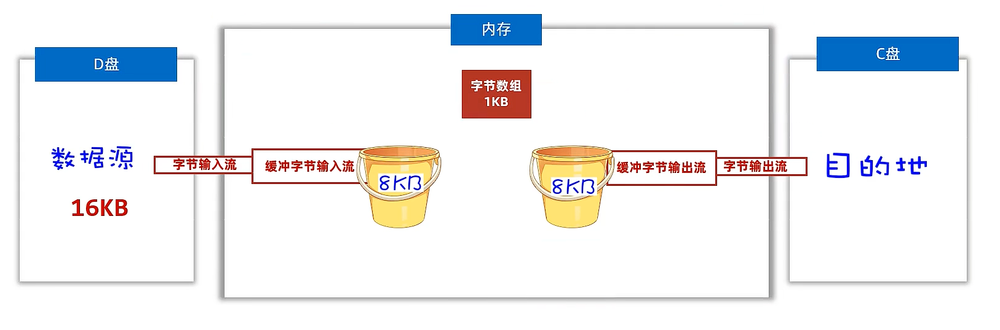

| 构造器                                         | 说明                                                                   |
| ---------------------------------------------- | ---------------------------------------------------------------------- |
| `public BufferedInputStream(InputStream is)`   | 把低级的字节输入流包装成一个高级的缓冲字节输入流, 从而提高读数据的性能 |
| `public BufferedOutputStream(OutputStream os)` | 把低级的字节输出流包装成一个高级的缓冲字节输出流, 从而提高写数据的性能 |

#### BufferedReader缓冲字符输入流

作用: 自带8K(8192)的字符缓冲池, 可以提高字符输入流读取字符数据的性能

| 构造器                            | 说明                                                                           |
| --------------------------------- | ------------------------------------------------------------------------------ |
| `public BufferedReader(Reader r)` | 把低级的字符输入流包装成字符缓冲输入流管道, 从而提高字符输入流读字符数据的性能 |

字符缓冲输入流新增功能: 按行读取字符

| 方法                       | 说明                                             |
| -------------------------- | ------------------------------------------------ |
| `public String readLine()` | 读取一行数据返回, 如果没有数据可读了, 会返回null |

#### BufferedWriter缓冲字符输出流

作用: 自带8K的字符缓冲池, 可以提高字符输出流写字符数据的性能

| 构造器 | 说明 |
| `public BufferedWriter(Writer r)` | 把低级的字符输出流包装成一个高级的缓冲字符输出流管道, 从而提高字符输出流写数据的性能 |

字符缓冲输出流新增的功能: 换行

| 方法                    | 说明 |
| ----------------------- | ---- |
| `public void newLine()` | 换行 |

### InputStreamReader(字符输入转换流)

- 解决不同编码时, 字符流读取文本内容乱码问题
- 解决思路: 先获取文件的原始字节流, 再将其按真实的字符集编码转成字符输入流, 这样字符输入流中的字符就不乱码了

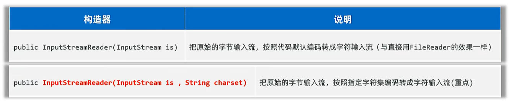

### 打印流

#### PrintStream/PrintWriter

- 作用: 打印流可以实现更方便, 更高效的打印数据出去, 能实现打印啥出去就是啥出去

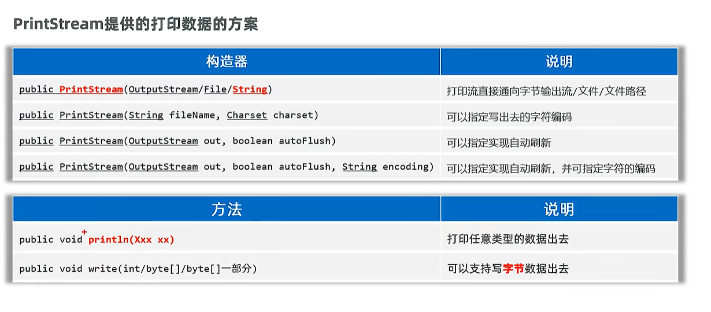

### 特殊数据流

#### DataOutputStream(数据输出流)

- 允许把数据和其类型一并写出去

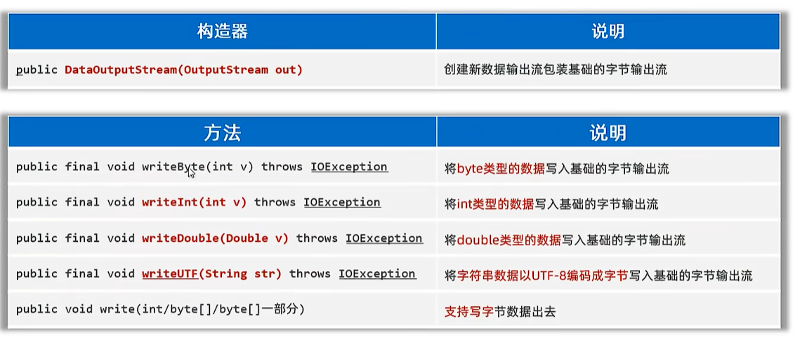

#### DataInputStream(数据输入流)

- 用于读取数据输出流写出去的数据

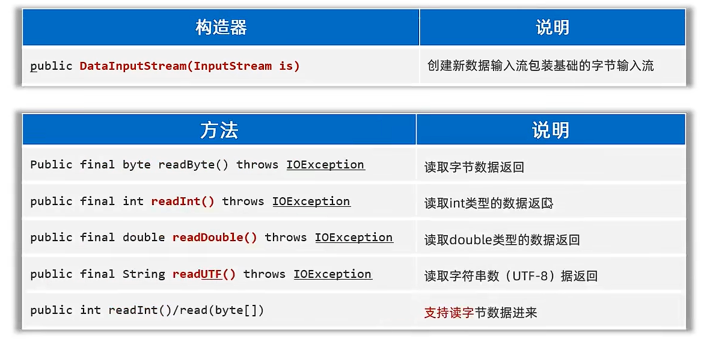

## Commons-io框架

- 框架(Framework)是一个预先写好的代码库或一组工具, 皆在简化和加速开发过程
- 框架的形式: 一半是把类, 接口等编译成class形式, 再压缩成一个.jar结尾的文件发行出去
- IO框架封装了Java提供的对文件,数据进行操作的代码, 对外提供了更简单的方式来对文件进行操作, 对数据进行读写等
- Commons-io是apache开源基金组织提供的一组有关IO操作的小框架, 目的是提高IO流的开发效率

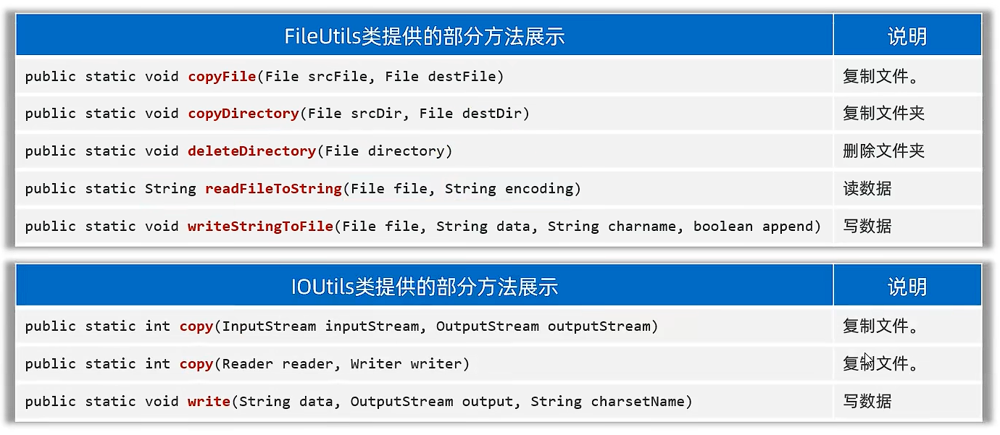

# 多线程

- 线程(Thread)是一个程序内部的一条执行流程

## 创建线程

### 多线程的创建方式之一: 继承Thread类

1. 定义一个子类MyThread继承线程类java.lang.Thread, 重写run()方法
2. 创建MyThread类的对象
3. 调用线程对象的start()方法启动线程(启动后会执行run方法)

优缺点:

- 优点: 编码简单
- 缺点: 线程类已经继承Thread, 无法继承其他类, 不利于功能的扩展

注意事项:

1. 启动线程必须是调用start方法, 不是调用run方法
    - 直接调用run方法会当成普通方法执行, 此时相当于还是单线程执行
    - 只有调用start方法才是启动一个新的线程执行

2. 不要把主线程人物放在启动子线程之前

### 多线程的创建方式二: 实现Runnable接口

1. 定义一个线程任务类MyRunnable实现Runnable接口, 重写Run()方法
2. 创建MyRunnable任务对象
3. 把MyRunnable任务对象交给Thread处理

| Thread类提供的构造器             | 说明                         |
| -------------------------------- | ---------------------------- |
| `public Thread(Runnable target)` | 封装Runnable对象成为线程对象 |

4. 调用线程对象的start()方法启动线程

优缺点:

- 优点: 人物类只是实现接口, 可以继续继承其他类, 实现其他接口, 扩展性强
- 缺点: 需要多一个Runnable对象

匿名内部类写法:

1. 可以创建Runnable的匿名内部类对象
2. 再交给Thread线程对象
3. 再调用线程对象的start()启动线程

### 多线程的创建方式三: 利用Callable接口, FutureTask类来实现

- 假如线程执行完毕后有一些数据需要返回, 我们重写的run方法均不能直接返回结果
- JDK5.0提供了Callable接口和FutureTask类来实现(多线程的第三种创建方式)
- 这种方式最大的优点: 可以返回线程执行完毕后的结果

1. 创建任务对象
    - 定义一个类实现Callable接口, 重写call方法, 封装要做的事情, 和要返回的数据
    - 把Callable类型的对象封装成FutureTask(线程任务对象)
2. 把线程任务交给Thread对象
3. 调用Thread对象的start方法启动线程
4. 线程执行完毕后, 通过FutureTask对象的get方法来获取线程任务执行的结果

FutureTask的API

| FutureTask提供的构造器               | 说明                               |
| ------------------------------------ | ---------------------------------- |
| `public FutureTask<>(Callable call)` | 把Callable对象封装成FutureTask对象 |
| `public V get() throws Exception`    | 获取线程执行call方法返回的结果     |

优缺点:

- 优点: 线程任务类只是实现接口, 可以继续继承类和实现接口, 扩展性强; 可以在线程执行完毕后去获取线程执行的结果
- 编码更复杂

## Thread的常用方法

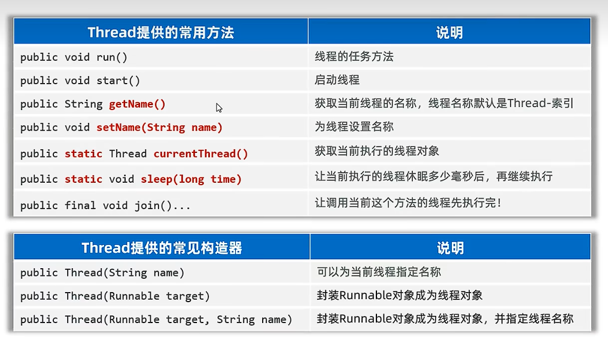

## 线程安全

- 多个线程同时操作同一个共享资源的时候, 可能会出现业务安全问题

### 线程同步

- 线程同步是线程安全问题的解决方案

线程同步的核心思想

- 让多个线程先后一次访问共享资源, 这样就可以避免出现线程安全问题

线程同步的常见方案:

#### 加锁: 每次只允许一个线程加锁, 加锁后才能进入访问, 访问完毕后自动解锁, 然后其他线程才能再加锁进来

``` java
synchronized(同步锁) {
    访问共享资源的核心代码
}
```

- 原理: 每次只允许一个线程加锁后进入, 执行完毕后自动解锁, 其他线程才可以进来执行

同步锁的注意事项

- 对于当前同时执行的线程来说, 同步锁必须是同一把(同一个对象), 否则会出bug

锁对象的使用规范:

- 建议使用共享资源作为锁对象, 对于实例方法建议使用`this`作为锁对象
- 对于静态方法建议使用字节码(类名.class)对象作为锁对象

#### 同步方法

- 作用: 把访问共享资源的核心方法给上锁, 以此保证线程安全

``` java
修饰符 synchronized 返回值类型 方法名称(形参列表) {
    操作共享资源的代码
}
```

原理: 每次只能一个线程进入, 执行完毕后自动解锁, 其他线程才可以进来执行

同步方法底层原理:

- 同步方法底层有隐式锁对象, 锁的范围是整个方法代码
- 如果方法是实例方法: 同步方法默认用`this`作为锁对象
- 如果方法是静态方法: 同步方法默认用`类名.class`作为锁对象

#### Lock锁

- Lock锁是JDK5开始提供的一个新的锁定操作, 通过它可以创建出锁对象进行加锁和解锁, 更灵活, 更方便, 更强大
- Lock是接口, 不能直接实例化, 可以采用它的实现类ReentrantLock来构建Lock锁对象

| 构造器                   | 说明                   |
| ------------------------ | ---------------------- |
| `public ReentrantLook()` | 获得Lock锁的实现类对象 |

Lock的常用方法:

| 方法名称        | 说明   |
| --------------- | ------ |
| `void lock()`   | 获得锁 |
| `void unlock()` | 释放锁 |

## 线程池

- 线程池是一种可以复用线程的技术

不用线程池的问题:

- 用户每发起一个请求, 后台就需要创建一个新线程来处理, 下次新任务来了又要创建新线程; 创建新线程的开销很大, 请求过多时会产生大量的线程, 这样会严重影响系统的性能

创建线程池:

- JDK5.0起提供了代表线程池的接口: ExecutorService
- 方式一: 使用ExecutorService的实现类ThreadPoolExecutor自创建一个线程池对象
- 方式二: 使用Executors(线程池的工具类)调用方法返回不同特点的线程池对象

### 方式一: 通过ThreadPoolExecutor创建线程池

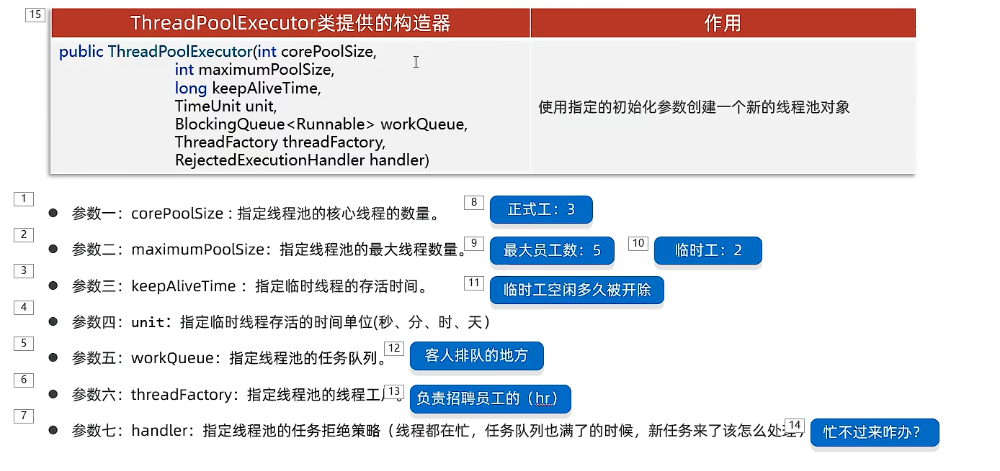

ExecutorService常用方法:

| 方法名称                             | 说明                                                         |
| ------------------------------------ | ------------------------------------------------------------ |
| `void execute(Runnable command)`     | 执行Runnable任务                                             |
| `Future<T> submit(Callable<T> task)` | 执行Callable任务, 返回未来任务对象, 用于获取线程返回的结果   |
| `void shutdown()`                    | 等全部任务执行完毕后, 再关闭线程池                           |
| `List<Runnable> shutdownNow()`       | 立即关闭线程池, 停止正在执行的任务, 并返回队列中未执行的任务 |

线程池的注意事项

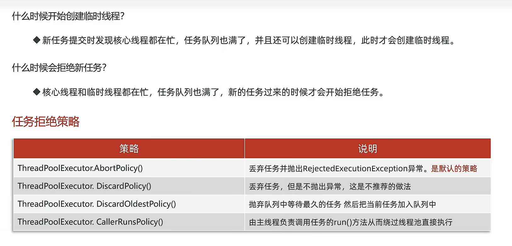

### 方式二: 通过Executors创建线程池

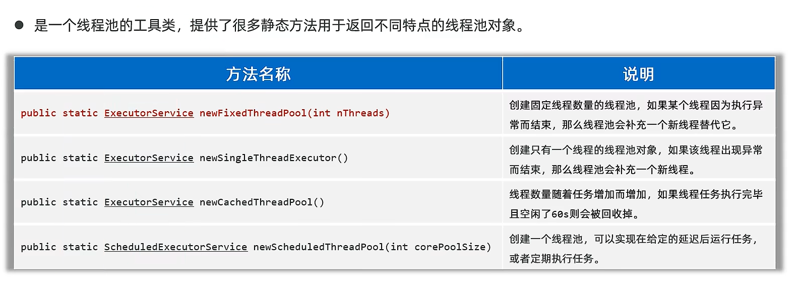

注意: 这些方法的底层都是通过线程池的实现类ThreadPoolExecutor创建的线程池对象

## 并发和并行

### 进程

- 正在运行的程序(软件)就是一个独立的进程
- 线程是属于进程的, 一个进程中可以同时运行多个线程
- 进程中的多个线程其实是并发和并行进行的

#### 并发

- 进程中的线程是由CPU负责调度执行的, 但CPU能同时处理线程的数量有限, 为了保证全部线程都能往前执行, CPU会轮询为系统的每个线程服务, 由于CPU切换的速度很快, 给我们感觉这些线程在同时执行, 这就是并发

#### 并行

- 在同一时刻, 同时有多个线程在被CPU调度执行


# Java网络编程

- 可以让设备中的程序与网络上其他设备中的程序进行数据交互的技术(实现网络通信)

## 基本的通信架构

- 基本的通信架构有2种形式: CS架构(Client客户端/Server服务端), BS架构(Browser浏览器/Server服务端)

无论是CS架构还是BS架构的软件都必须依赖网络编程

## 网络通信三要素

1. IP地址: 设备在网络中的地址, 是设备在网络中的唯一标识
2. 端口: 应用程序在设备中的唯一标识
3. 协议: 连接和数据在网络中传输的规则

### IP地址

- IP(Internet Protocol): 全称"互联网协议地址", 是分配给上网设备的唯一标识
- 目前, 被广泛采用的IP地址形式有两种: IPv4, IPv6

### IP域名(Domain Name)

用于在互联网上识别和定位网站的人类可读的名称

DNS域名解析(Domain Name System)

是互联网中用于将域名转换为对应IP地址的分布式命名系统. 它充当了互联网的"电话簿", 将易记的域名映射到数字化的IP地址, 使得用户可以通过域名来访问网站和其他网络资源

### 公网IP, 内网IP

公网IP: 是可以连接到互联网的IP地址
内网IP: 也叫局域网IP, 是组织机构内部使用的IP地址; 例如192.168.开头的就是常见的局域网地址, 范围为192.168.0.0--192.168.255.255, 专门为组织机构内部使用

#### 本机IP

127.0.0.1, localhost: 代表本机IP, 只会寻找当前程序所在的主机

## InetAddress

代表IP地址

InetAddress常用方法

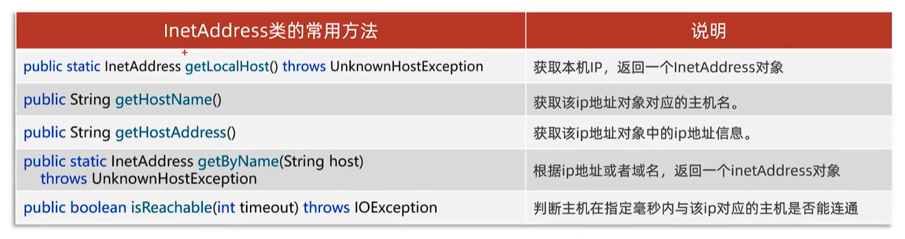

### 端口

用来标记正在计算机上运行的应用程序, 被规定为一个16位的二进制数, 范围是0~65535

#### 端口分类

周知端口: 0~1023, 被预先定义的知名应用占用(如HTTP占用80, FTP占用21)
注册端口: 1024~49151, 分配给用户进程或某些应用程序
动态端口: 49152到65535, 之所以被称为动态端口, 是因为它一般不固定分配某种进程, 而是动态分配

注意: 我们自己开发的程序一般选择使用注册端口, 且一个设备中不能出现两个程序的端口号一样, 否则报错

### 通信协议

网络上通信的设备, 事先规定的连接规则, 以及传输数据的规则被称为网络通信协议

#### 开放式网络互联标准: OSI网络参考模型

OSI网络参考模型: 全球网络互联标准
TCP/IP网络模型: 事实上的国际标准

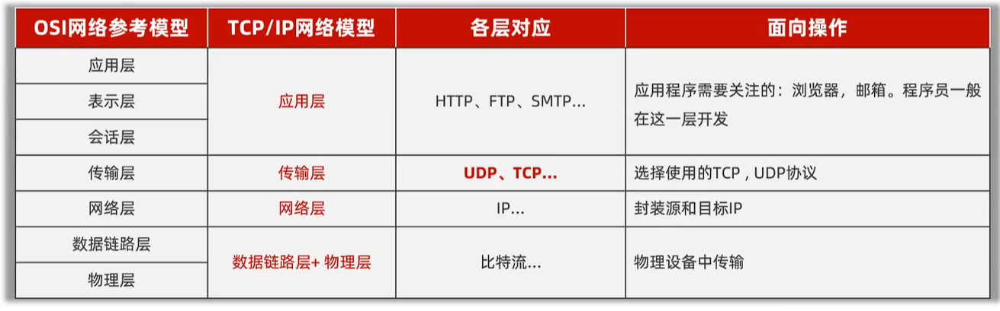

#### 传输层的2个通信协议

UDP(User Datagram Protocol): 用户数据报协议
TCP(Transmission Control Protocol): 传输控制协议

##### UDP协议

特点: 无连接, 不可靠通信

不事先建立连接, 数据按照包发, 一包数据包含: 自己的IP, 端口, 目的地IP, 端口和数据(限制在64KB内)等

发送方不管对方是否在线, 数据在中间丢失也不管, 接收方收到数据不返回确认, 所以是不可靠的

##### TCP协议

特点: 面向连接, 可靠通信

TCP的最终目的: 要保证在不可靠的信道上实现可靠的数据传输

TCP主要有三个步骤实现可靠传输: 三次握手建立连接, 传输数据进行确认, 四次挥手断开连接

## UDP通信的实现

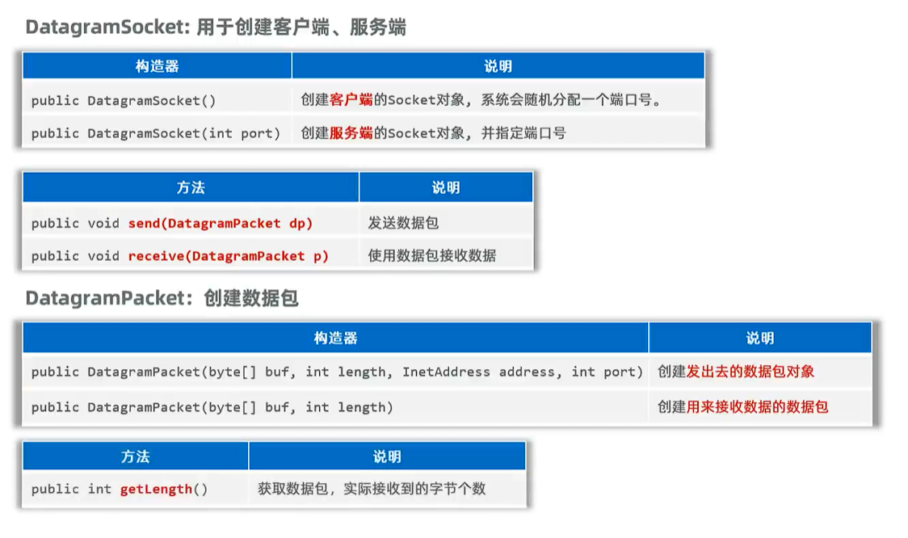

### 客户端可以反复发送数据

客户端实现步骤:

1. 创建DatagramSocket对象(发送端对象)
2. 使用while死循环不断地接受用户的数据输入, 如果用户输入的是exit则退出程序
3. 如果用户输入的不是exit, 把数据封装成DatagramPacket
4. 使用DatagramSocket对象的send方法将数据包对象进行发送
5. 释放资源

## TCP通信的实现

- 特点: 面向连接, 可靠通信
- 通信双方事先会用"三次握手"方式建立可靠连接, 实现端到端通信; 底层能保证数据成功传给服务端
- Java提供了一个java.net.Socket类来实现TCP通信
- 客户端程序就是通过java.net包下的Socket类来实现的

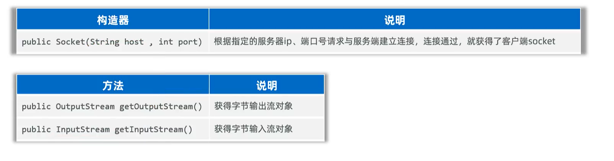

### TCP通信实现一发一收--客户端开发

1. 创建客户端的Socket对象, 请求与服务端的连接
2. 使用socket对象调用getOutputStream()方法得到字节输出流
3. 使用字节输出流完成数据的发送
4. 释放资源: 关闭socket管道

### TCP通信实现一发一收--服务端开发

- 服务端是通过java.net包下的ServerSocket类来实现的

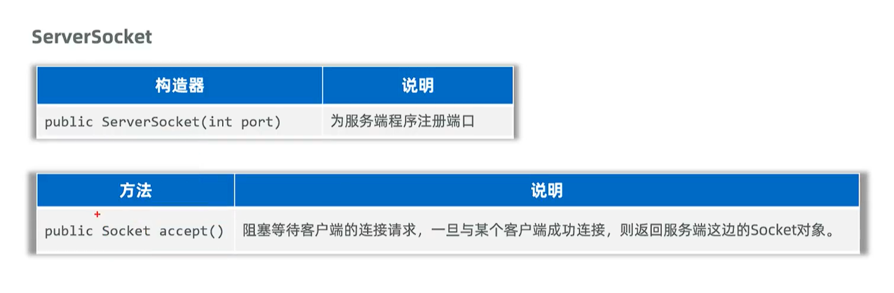

1. 创建ServerSocket对象, 注册服务端端口
2. 调用ServerSocket对象的accept()方法, 等待客户端的链接, 并得到Socket管道对象
3. 通过Socket对象调用getInputStream()方法得到字节输入流, 完成数据的接收

# 时间相关的获取方案

- LocalDate: 代表本地日期(年, 月, 日, 星期)
- LocalTime: 代表本地时间(时, 分, 秒, 纳秒)
- LocalDateTime: 代表本地日期, 时间(年, 月, 日, 星期, 时, 分, 秒, 纳秒)

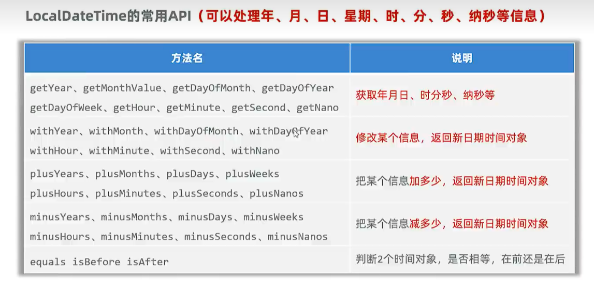

``` java
// JDK8之后的方案: LocalDate LocalTime LocalDateTime 获取此刻日期时间 新项目推荐
// 获取此刻时间对象
LocalDateTime now = LocalDateTime.now();
System.out.println(now);
System.out.println(now.getYear());
System.out.println(now.getDayOfYear);

LocalDateTime now2 = now.plusSeconds(60); // 60秒后
System.out.println(now);
System.out.println(now2);

// 格式化: DateTimeFormatter
// 1. 创建一个格式化对象
DateTimeFormatter def = DateTimeFormatter.ofPattern("yyyy/MM/dd HH:mm:ss EEE a");
// 2. 格式化now对象的时间
String result2 = dtf.format(now);
System.out.println(result2);
```

# 字符串的高效操作方案

- '+'号拼接字符串内容, 如果是大量拼接, 效率极差
- String的对象是不可变变量, 共享数据性能可以, 但修改数据性能差

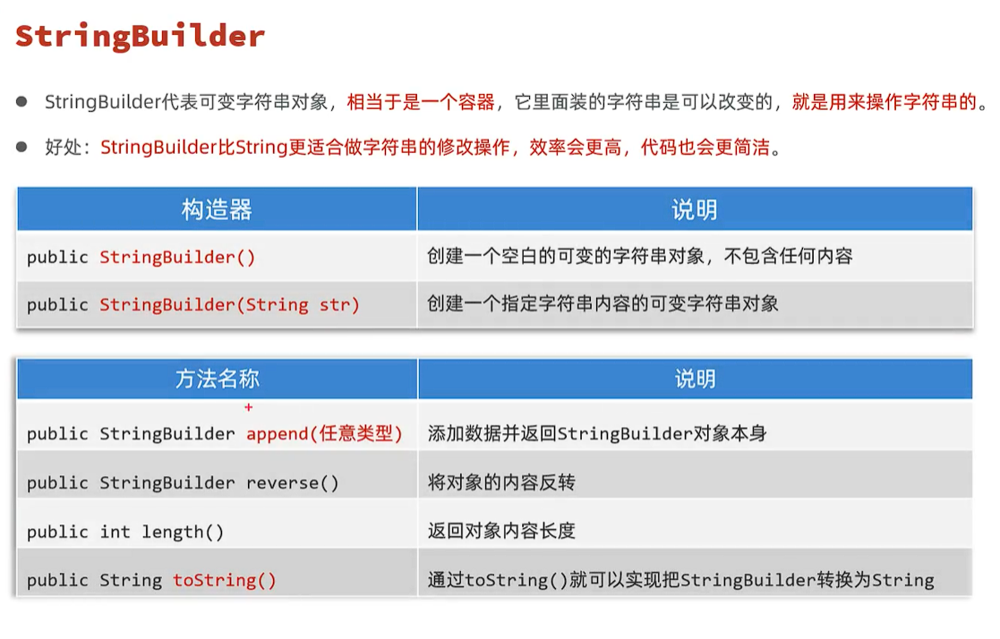

``` java
// 定义字符串可以使用String类型, 操作字符串建议使用StringBuilder(性能好)
StringBuilder sb = new StringBuilder(); // StringBuilder对象是可变内容的容器 sb = "";
for (int i = 0; i < 100000; i++) {
    ab.append("abc");
}
System.out.println(sb);
// StringBuilder只是拼接字符串的手段, 结果还是要恢复成字符串(目的)
String s = sb.toString();
System.out.println(s);
```

# 浮点数精确计算: BigDecimal

- 用于解决浮点型运算时, 出现结果失真的问题

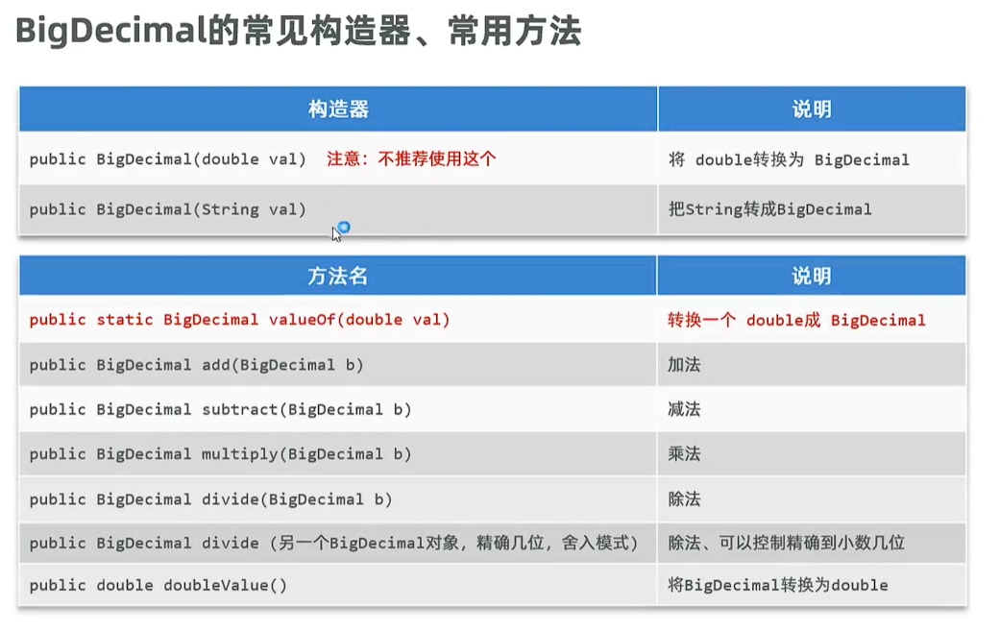

``` java
public static void main(String[] args) {
    double a = 0.1;
    double b = 0.2;
    System.out.println(a + b); // 0.3000000000000004

    // 如何解决? 使用BigDecimal
    // 1. 把小数包装成BigDecimal对象来运算才可以
    // 必须使用public BigDecimal(String val) 字符串构造器才能解决失真问题
    BigDecimal a1 = new BigDecimal(Double.toString(a));
    BigDecimal b1 = new BigDecimal(Double.toString(b));

    // 优化方案: 可以直接调用valueOf方法, 内部使用的就是public BigDecimal(String val)字符串构造器
    BigDecimal a2 = BigDecimal.valueOf(a);
    BigDecimal b2 = BigDecimal.valueOf(b);

    BigDecimal c1 = a1.add(b1);   // 解决精度问题的手段
    BigDecimal c2 = a2.add(b2);

    double result1 = c1.doubleValue();  // 目的
    double result2 = c2.doubleValue();
}
```

# Java高级技术

## 单元测试

- 针对最小的功能单元: 方法, 编写测试代码对其进行正确性测试

### Junit单元测试框架

- 可以用来对方法进行测试, 它是第三方公司开源出来的(很多开发工具已经集成了Junit框架, 比如IDEA)

优点:

- 可以灵活的编写测试代码, 可以针对某个方法执行测试, 也支持一键完成对全部方法的自动化测试, 且各自独立
- 不需要程序员分析测试的结果, 会自动生成测试报告

### Junit单元测试的使用步骤

需求:

- 某个系统, 有多个业务方法, 请使用Junit单元测试框架, 编写测试代码, 完成对这些方法的正确性测试

具体步骤

1. 将Junit框架的jar包导入到项目中(注意: IDEA集成了Junit框架, 不需要手工导入)
2. 为需要测试的业务类, 定义对应的测试类, 并为每个业务方法编写对应的测试方法(必须: 公共, 无参, 无返回值)
3. 测试方法必须声明@Test注解, 然后在测试方法中编写代码调用被测试的业务方法进行测试
4. 开始测试: 选中测试方法, 右键选择"JUnit运行", 如果测试通过则是绿色, 如果测试失败则是红色

## 反射(Reflection)

- 反射就是: 加载类, 并允许以编程的方式解剖类中的各种成分(成员变量, 方法, 构造器等)

1. 反射第一步: 加载类, 获取类的字节码: Class对象
2. 获取类的构造器: Constructor对象
3. 获取类的成员变量: Field对象
4. 获取类的成员方法: Method对象

### 获取Class对象的三种方式

- Class c1 = 类名.class
- 调用Class提供方法: public static Class forName(String package);
- 对象.getClass()

### 反射获取类中的成分并操作

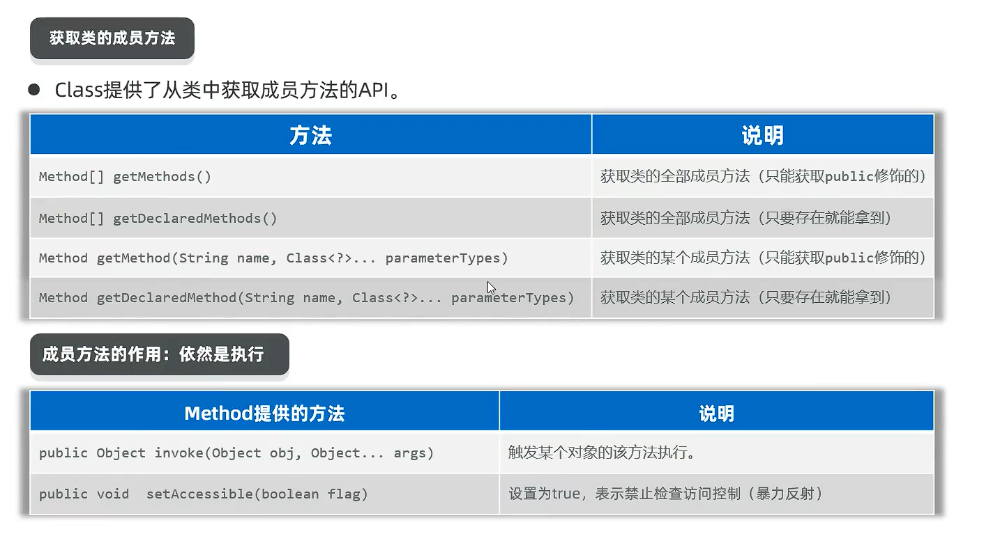

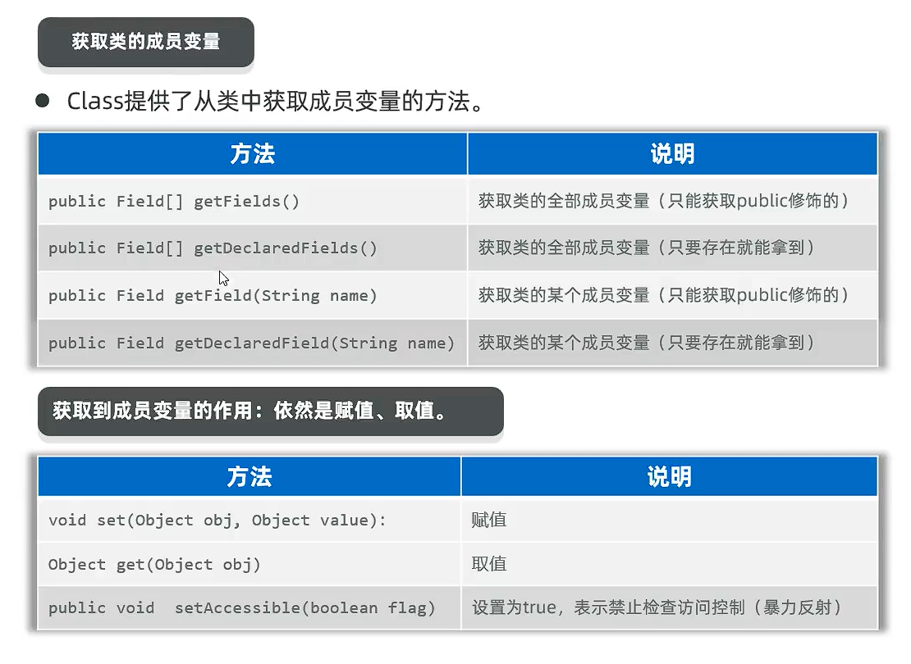

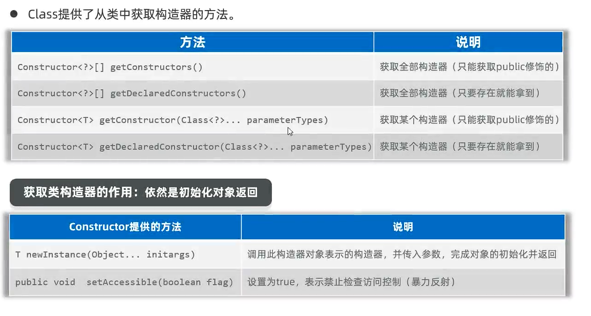

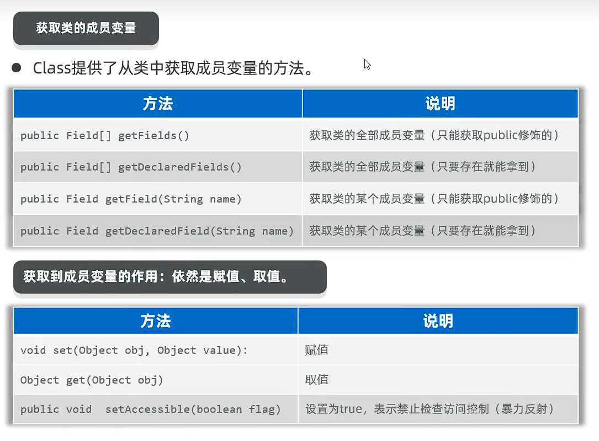

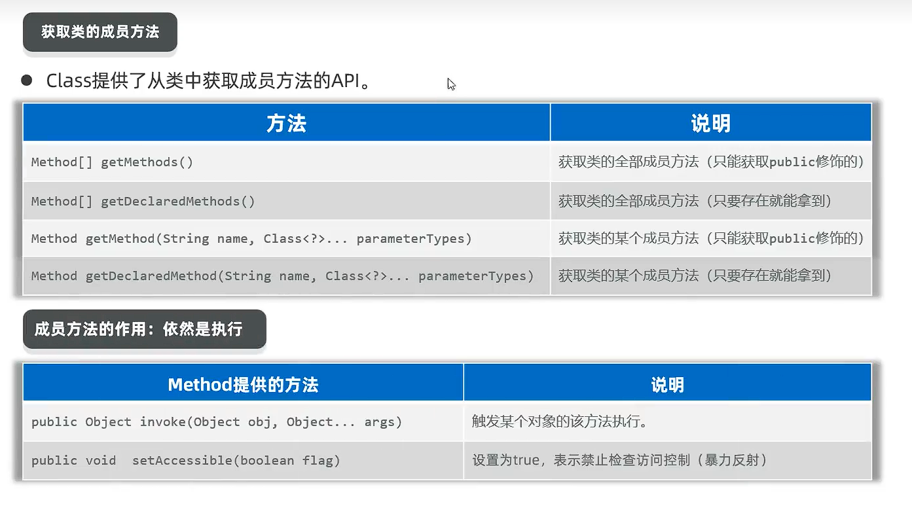

### 反射的基本作用

- 基本作用: 可以得到一个类的全部成分然后操作
- 可以破坏封装性
- 可以绕过泛型的约束
- 最重要的用途: 适合做Java的框架, 基本上主流的框架都会基于反射设计出一些通用的功能

## 注解

### 注解概述

- 就是Java代码里的特殊标记, 比如: @Override, @Test, 作用是: 让其他程序根据注解信息来决定怎么执行该程序
- 注意: 注解可以用在类上, 构造器上, 方法上, 成员变量上, 参数上...

### 自定义注解

``` java
public @interface 注解名称 {
    public 属性类型 属性名() default 默认值;
}
```

特殊属性名: value

- 如果注解中只有一个value属性, 使用注解时, value名称可以省略不写

### 注解的原理

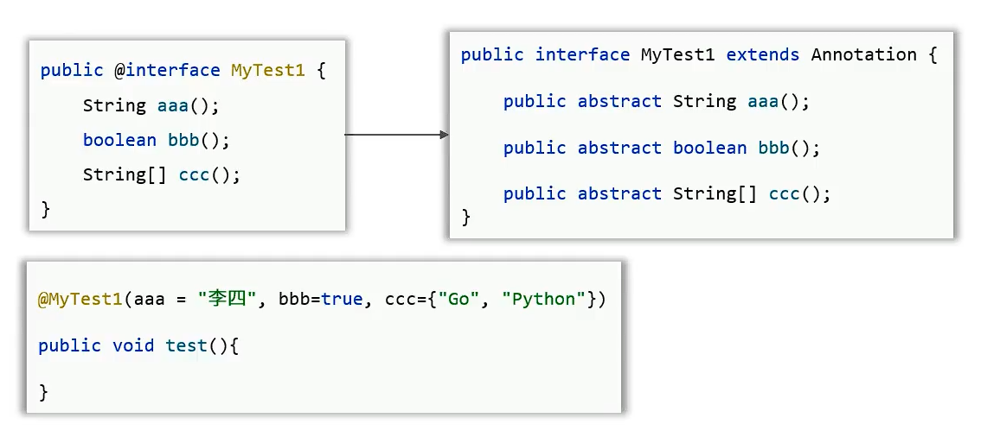

- 注解本质是一个接口, Java中所有注解都继承了Annotation接口
- @注解(...): 其实就是一个实现类对象, 实现了该注解以及Annotation接口

### 元注解

- 元注解: 注解注解的注解

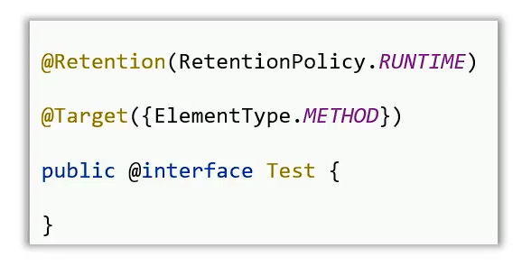

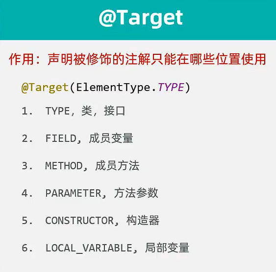


### 注解的解析

- 就是判断类上, 方法上, 成员变量上是否存在注解, 并把注解里的内容解析出来
- 指导思想: 要解析谁上面的注解, 就应该先拿到谁
- 比如要解析类上的注解, 则应该先获取类的Class对象, 再通过Class对象解析其上面的注解
- 比如要解析成员方法上的注解, 则应该获取到该成员方法的Method对象, 再通过Method对象解析其上面的注解
- Class, Method, Field, Constructor, 都实现了AnnotatedElement接口, 它们都拥有解析注解的能力

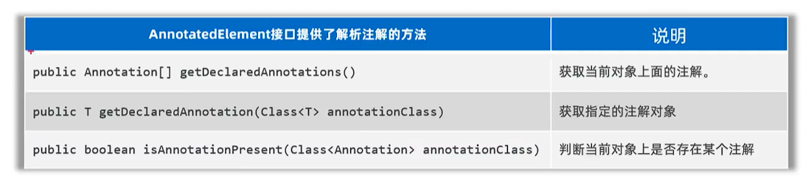

## 动态代理

### 为Java对象创建代理对象

- java.lang.reflect.Proxy类: 提供了为对象产生代理对象的方法:

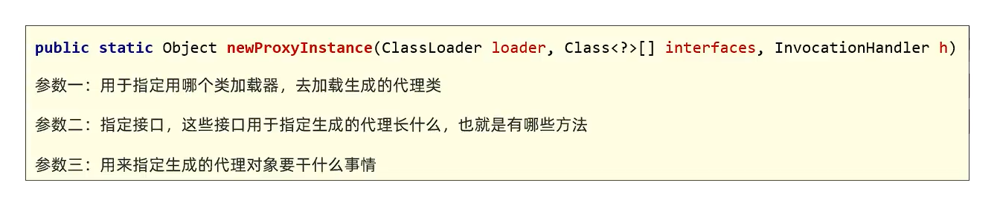